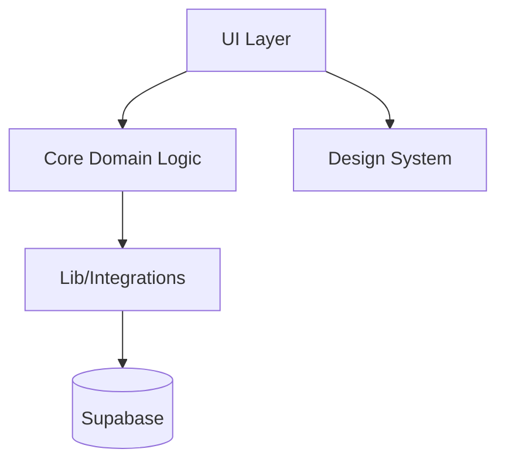

type: doc
name: architecture
description: System architecture, layers, patterns, and design decisions
category: architecture
generated: 2026-01-24
status: unfilled
scaffoldVersion: "2.0.0"

## Architecture Notes

A aplicação SaaS Valuation é estruturada para fornecer uma plataforma robusta, sustentável e escalável para análise financeira e avaliação de empresas. A arquitetura aproveita design modular, separação clara de responsabilidades e melhores práticas modernas de desenvolvimento web. O design atual existe para suportar desenvolvimento rápido de funcionalidades, forte tipagem e integração perfeita com serviços externos como Supabase.

## System Architecture Overview

O sistema segue uma abordagem de monólito modular, com separação clara entre lógica de negócio central, componentes de UI e integrações de infraestrutura. A aplicação é construída com Next.js (React) para o frontend, TypeScript para segurança de tipos e Supabase para backend-as-a-service (autenticação, banco de dados e armazenamento). As requisições fluem da UI (em `src/app/` e `src/components/`) através dos módulos de negócio centrais (`src/core/`), com acesso a dados e integração com serviços externos tratados em `src/lib/`.

## Architectural Layers

- **App Layer**: Gerencia roteamento, estilos globais e layout ([src/app/](../../src/app/))
- **UI Components**: Elementos de UI reutilizáveis ([src/components/ui/](../../src/components/ui/))
- **Core Domain Logic**: Regras de negócio e modelos de domínio ([src/core/](../../src/core/))
- **Lib/Integrations**: Serviços externos, cliente Supabase e funções utilitárias ([src/lib/](../../src/lib/))
- **Styles/Design System**: Temas, tokens e primitivas de design ([src/styles/design-system/](../../src/styles/design-system/))

> Veja [codebase-map.json](./codebase-map.json) para contagem completa de símbolos e grafos de dependência.

## Detected Design Patterns

| Pattern        | Confidence | Locations                                  | Description                            |
| -------------- | ---------- | ------------------------------------------ | -------------------------------------- |
| Modularization | 90%        | `src/core/`, `src/lib/`, `src/components/` | Separação de domínio, UI e integrações |
| Adapter        | 80%        | `src/lib/supabase/`                        | Abstrai cliente e API do Supabase      |
| Design System  | 85%        | `src/styles/design-system/`                | Centraliza tokens de UI e temas        |

## Entry Points

- [src/app/page.tsx](../../src/app/page.tsx)
- [src/app/layout.tsx](../../src/app/layout.tsx)
- [src/lib/supabase/server.ts](../../src/lib/supabase/server.ts)

## Public API

| Symbol             | Type     | Location                                                       |
| ------------------ | -------- | -------------------------------------------------------------- |
| SupabaseClient     | function | [src/lib/supabase/client.ts](../../src/lib/supabase/client.ts) |
| getCompanyData     | function | [src/core/company/](../../src/core/company/)                   |
| getFinancials      | function | [src/core/financial/](../../src/core/financial/)               |
| calculateValuation | function | [src/core/valuation/](../../src/core/valuation/)               |

## Internal System Boundaries

O sistema é organizado por domínio (company, financial, valuation), com cada domínio encapsulado em seu próprio módulo em `src/core/`. Acesso a dados e integrações externas são abstraídos em `src/lib/`, garantindo que a lógica de negócio permaneça desacoplada de preocupações de infraestrutura.

## External Service Dependencies

- **Supabase**: Autenticação, banco de dados e armazenamento. Usa tokens JWT e acesso baseado em roles. Gerencia rate limits e retries via SDK integrado.

## Key Decisions & Trade-offs

Escolhemos um monólito modular para simplicidade e manutenibilidade em estágios iniciais, com caminhos claros para futura modularização ou microserviços se a escala exigir. Supabase foi selecionado para habilitação rápida de backend e infraestrutura gerenciada.

## Diagrams

## Risks & Constraints

- Dependência do Supabase para serviços de backend introduz vendor lock-in e SLAs externos.
- Escalar além da arquitetura atual pode requerer refatoração para microserviços.

## Top Directories Snapshot

- `src/app/` — 3 arquivos
- `src/components/` — 2 arquivos
- `src/core/` — 3 módulos de domínio
- `src/lib/` — 4 módulos de integração
- `src/styles/` — 2 diretórios principais de estilos
- `public/` — assets estáticos

## Related Resources

- [Project Overview](./project-overview.md)
- [Data Flow & Integrations](./data-flow.md)
- [codebase-map.json](./codebase-map.json)
