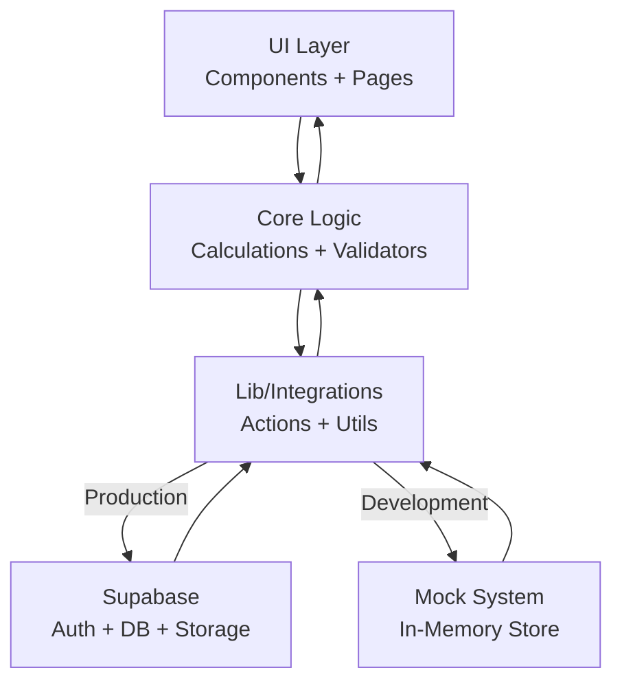
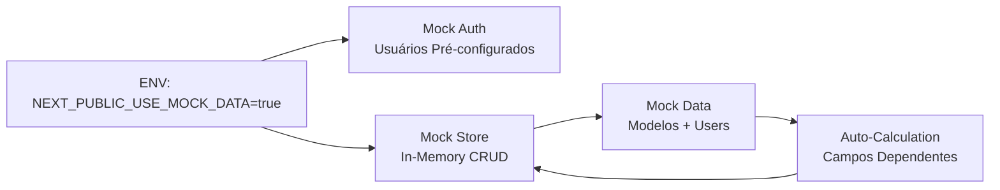

## Architecture Notes

The SaaS Valuation system is designed as a modular web application using Next.js, with a clear separation between UI components, domain logic, and infrastructure integrations. The architecture emphasizes maintainability, testability, and scalability, leveraging TypeScript for type safety and Supabase for backend services.

## System Architecture Overview

The application follows a modular monolith approach, where all core modules reside in a single codebase but are organized by domain and responsibility. User requests flow from the frontend (React/Next.js) through domain logic in `src/core/` and interact with Supabase for authentication, data persistence, and file storage. All business logic is isolated from infrastructure concerns.

## Architectural Layers

- **App Layer**: User interface and routing (`src/app/`, `src/components/`)
- **Core Layer**: Domain logic, calculations, and business rules (`src/core/`)
- **Lib Layer**: Utilities, integrations, and shared helpers (`src/lib/`)
  - **Mock Layer**: Development mock system (`src/lib/mock/`) - provides in-memory data for development without backend
- **Types Layer**: Shared type definitions (`src/types/`, `src/core/types/`)
- **Styles Layer**: Design system and global styles (`src/styles/`)

> See [`codebase-map.json`](./codebase-map.json) for complete symbol counts and dependency graphs.

## Detected Design Patterns

| Pattern        | Confidence | Locations                                       | Description                                          |
| -------------- | ---------- | ----------------------------------------------- | ---------------------------------------------------- |
| Modularization | High       | `src/core/`, `src/lib/`, `src/components/`      | Separation of concerns by domain/responsibility      |
| Adapter        | Medium     | `src/lib/supabase/`, `src/lib/actions/`         | Abstracts external service integration               |
| Factory        | Medium     | `src/lib/supabase/client.ts`, `server.ts`       | Creates configured Supabase clients                  |
| Validation     | High       | `src/core/validators/`                          | Centralized input validation logic                   |
| Mock Object    | High       | `src/lib/mock/`                                 | In-memory mock system for development                |
| Repository     | Medium     | `src/lib/mock/store.ts`                         | Centralized data access with CRUD operations         |
| Composition    | High       | `src/components/ui/`                            | Composable UI components with Radix UI               |
| Registry       | Medium     | `src/core/calculations/indicadores.ts`          | Array de funções de cálculo registradas dinamicamente; facilita adição de novos indicadores |

## Entry Points

- [middleware.ts](../../middleware.ts)
- [src/app/layout.tsx](../../src/app/layout.tsx)
- [src/app/(auth)/login/page.tsx](<../../src/app/(auth)/login/page.tsx>)
- [src/app/(dashboard)/model/[id]/](<../../src/app/(dashboard)/model/[id]/>)

## Public API

| Symbol             | Type      | Location                                                                           |
| ------------------ | --------- | ---------------------------------------------------------------------------------- |
| ApiError           | type      | [src/types/index.ts](../../src/types/index.ts#L21)                                 |
| APIRequest         | type      | [src/core/types/index.ts](../../src/core/types/index.ts#L71)                       |
| ApiResponse        | type      | [src/types/index.ts](../../src/types/index.ts#L14)                                 |
| APIResponse        | type      | [src/core/types/index.ts](../../src/core/types/index.ts#L76)                       |
| AppSidebar         | component | [src/components/app-sidebar.tsx](../../src/components/app-sidebar.tsx#L159)        |
| Assumptions        | type      | [src/core/types/index.ts](../../src/core/types/index.ts#L49)                       |
| AuthSession        | type      | [src/types/user.ts](../../src/types/user.ts#L39)                                   |
| BalanceSheet       | type      | [src/types/financial.ts](../../src/types/financial.ts#L23)                         |
| BalanceSheet       | type      | [src/core/types/index.ts](../../src/core/types/index.ts#L27)                       |
| calculateValuation      | function  | [src/core/calculations/valuation.ts](../../src/core/calculations/valuation.ts#L21)        |
| calculateWACC           | function  | [src/core/calculations/wacc.ts](../../src/core/calculations/wacc.ts#L27)                  |
| calculateIndicadores    | function  | [src/core/calculations/indicadores.ts](../../src/core/calculations/indicadores.ts#L100)   |
| calculateAllIndicadores | function  | [src/core/calculations/indicadores.ts](../../src/core/calculations/indicadores.ts#L128)   |
| createClient            | function  | [src/lib/supabase/server.ts](../../src/lib/supabase/server.ts#L5)                         |
| createModel             | function  | [src/lib/actions/models.ts](../../src/lib/actions/models.ts#L122)                         |
| duplicateModel          | function  | [src/lib/actions/models.ts](../../src/lib/actions/models.ts#L275)                         |

## Internal System Boundaries

Domain logic in `src/core/` is decoupled from infrastructure and UI. Integrations with Supabase are abstracted in `src/lib/supabase/`. Shared types enforce contracts between layers.

## Mock Data System (Development Mode)

O sistema inclui um **modo mock completo** para desenvolvimento sem conexão com Supabase. Ativado via `NEXT_PUBLIC_USE_MOCK_DATA=true`, o mock:

- **Store In-Memory**: Armazena dados em memória com CRUD completo (`src/lib/mock/store.ts`)
- **Auth Mock**: Sistema de autenticação simulada com usuários pré-configurados (`src/lib/mock/auth.ts`)
- **Data Generators**: Gera automaticamente dados de modelos financeiros (`src/lib/mock/data/`)
- **DevModeIndicator**: Badge visual indicando modo mock ativo
- **Auto-calculation**: Calcula automaticamente campos dependentes (Lucro Bruto, EBITDA, etc.)

Arquivos principais:
- `src/lib/mock/index.ts` - API principal do sistema mock
- `src/lib/mock/store.ts` - Armazenamento in-memory com simulação de latência
- `src/lib/mock/auth.ts` - Autenticação mock com sessões
- `src/lib/mock/data/models.ts` - Dados de modelos financeiros
- `src/lib/mock/utils.ts` - Cálculos automáticos de campos

**Documentação completa**: [MOCK_MODE.md](../../MOCK_MODE.md)

## Cálculo de Despesas Financeiras por Empréstimos (CP/LP)

`src/core/calculations/balanceSheet.ts` — `calculateBPProjetado`

As despesas financeiras são calculadas **separadamente para CP e LP** e usam o **saldo inicial do ano anterior** para evitar circularidade (dependência circular entre dívida e despesas):

```typescript
// Calculadas ANTES dos novos empréstimos para evitar circularidade
const despesasFinanceirasCP = bpAnterior.passivoCirculante.emprestimosCP × taxaJuros;
const despesasFinanceirasLP = bpAnterior.passivoRealizavelLP.emprestimosLP × taxaJuros;
const despesasFinanceiras = despesasFinanceirasCP + despesasFinanceirasLP; // invariante

// Saldo de empréstimos = início + novos - juros pagos
const emprestimosCP = bpAnterior.CP + novosCP - despesasFinanceirasCP;
const emprestimosLP = bpAnterior.LP + novosLP - despesasFinanceirasLP;
```

**Campos em `BalanceSheetCalculated`** (`src/core/types/index.ts`):
- `despesasFinanceirasCP` — empréstimos CP × taxaJurosEmprestimo
- `despesasFinanceirasLP` — empréstimos LP × taxaJurosEmprestimo
- `despesasFinanceiras` — CP + LP (invariante: sempre igual à soma dos dois)

**Exibição em `LoansTable`**: linhas separadas para despesas financeiras CP e LP, com seção de taxa de juros movida para o final da tabela (abaixo dos saldos).

## Módulo de Indicadores Financeiros

O módulo `src/core/calculations/indicadores.ts` implementa o cálculo de indicadores/ratios financeiros usando o **Registry Pattern**:

```typescript
// Indicadores atualmente implementados:
// - Vendas / Imobilizado = Receita Bruta / Imobilizado Líquido
//   Mede eficiência no uso de ativos fixos (quanto maior, mais eficiente)
// - Empréstimos / EBITDA = (EmpCP + EmpLP) / EBITDA
//   Mede alavancagem financeira (quanto menor, menor risco de crédito)

const INDICATOR_REGISTRY: IndicadorFn[] = [
  calcVendasImobilizado,
  calcEmprestimosEbitda,
  // adicionar novos indicadores aqui
];
```

**Como adicionar um novo indicador**:
1. Criar função `calcNomeDoIndicador(dre, bp): IndicadorCalculated`
2. Adicionar ao `INDICATOR_REGISTRY`
3. O indicador é automaticamente calculado em `calculateIndicadores` e `calculateAllIndicadores`

**Formato de retorno** (`IndicadorCalculated`):
- `id` — slug único do indicador
- `label` — nome legível
- `value` — valor calculado
- `format` — tipo de formatação (`"multiple"`, `"percentage"`, etc.)
- `numerator` / `denominator` — componentes para transparência do cálculo

## External Service Dependencies

- **Supabase**: Auth, database, and file storage. Uses JWT for authentication and SDK for API calls.
- **Mock System**: Optional in-memory replacement for Supabase during development (zero external dependencies)

## Key Decisions & Trade-offs

- Chose modular monolith for simplicity and maintainability.
- TypeScript for type safety and developer tooling.
- Supabase for rapid backend provisioning and managed auth.

## Diagrams

### Arquitetura Principal



### Sistema de Mock (Modo Desenvolvimento)



## Risks & Constraints

- Scaling is limited by Supabase plan and Next.js serverless model.
- All operations are synchronous; no event-driven or queue-based processing.

## Design System

### Tokens e Estilos (`src/app/globals.css`)

O projeto possui um Design System completo baseado em **shadcn/ui** com tokens CSS em espaço de cor **oklch**:

- **Cor primária da marca:** Azul-Índigo `oklch(0.488 0.243 264)` — profissional e confiável para aplicação financeira
- **Escalas completas:** `--primary-50` a `--primary-900` e `--neutral-50` a `--neutral-900`
- **Cores semânticas:** `--success`, `--warning`, `--info` (+ variantes `*-foreground`)
- **Dark mode:** invertido via classe `.dark` (next-themes)
- **Espaço de cor:** oklch (perceptualmente uniforme — melhor acessibilidade de contraste)
- **`@theme inline`:** mapeia todos os tokens para classes Tailwind (`bg-primary`, `text-success`, etc.)
- **Font:** Inter (Google Fonts) via `--font-sans`
- **Radius base:** `--radius: 0.625rem` (10px) com escala sm → 4xl

### Styleguide (`src/app/styleguide/`)

Rota `/styleguide` com navegação lateral — documentação visual do Design System:

| Arquivo | Descrição |
|---|---|
| `navigation.ts` | Config de navegação da sidebar (Foundation + Components) |
| `layout.tsx` | Layout com sidebar fixa, link de volta ao dashboard |
| `page.tsx` | Página de tokens: paletas, escalas, tipografia, radius, sombras, componentes demo, dark mode toggle |
| `components/grafico-combinado/page.tsx` | Showcase do componente `GraficoCombinado` |

### tailwind.config.ts

Simplificado para o Tailwind v4: **não** contém mapeamento de cores (o `@theme inline` em `globals.css` é suficiente). Mantém apenas `fontFamily`.

## UI Component System

O projeto utiliza **Radix UI** e **shadcn/ui** para componentes acessíveis e composáveis:

**Componentes Base** (`src/components/ui/`):
- `button`, `card`, `dialog`, `form`, `input`, `label`, `tabs`
- `sheet`, `sidebar`, `tooltip`, `badge`, `separator`
- `financial-input` - Input especializado para valores monetários
- Todos seguem padrões de acessibilidade WAI-ARIA

**Componentes de Layout**:
- `PageHeader` - Header reutilizável com breadcrumbs
- `AppSidebar` - Navegação lateral colapsável
- `DevModeIndicator` - Indicador visual de modo mock

**Componentes de Visualização** (`src/components/charts/`):
- `DREChartsSection` - Seção de gráficos para DRE (Receita, Custos, EBITDA)
- `FCFFChartsSection` - Seção de gráficos para FCFF
- `InvestmentChartSection`, `WorkingCapitalChartSection`, `LoansChartSection` - Seções de gráficos do Balanço
- `RevenueChart`, `CostCompositionChart`, `EBITDAChart`, `FCFFChart` - Gráficos individuais
- `GraficoCombinado` - Componente genérico reutilizável: `ComposedChart` com Bar + Line + dois eixos Y + toggle switch
- Carregamento dinâmico com `next/dynamic` para evitar problemas de hydration
- Skeleton loading states durante carregamento

**`GraficoCombinado` — API resumida:**
```typescript
<GraficoCombinado
  data={dados}           // GraficoCombinadoDado[]
  xAxisKey="ano"
  barPrimaria={{ dataKey, name, color }}
  barSecundaria={{ dataKey, name, color }}  // opcional — habilita toggle
  linha={{ dataKey, name, color, valueFormatter? }}
  title="Título"
  leftAxisFormatter={(v) => formatCompactNumber(v)}
  rightAxisFormatter={(v) => `${v.toFixed(1)}x`}
/>
```

**Componentes de Domínio** (`src/app/(dashboard)/`):
- `ModelCard` - Card de modelo com ações CRUD
- Forms de entrada de dados (DRE, Balanço)
- Tabelas financeiras (DRETable, BalanceSheetTable, FCFFTable)

## Sistema de Navegação e Input de Dados

### Padrão de Input Não-Controlado

Para componentes de input em tabelas grandes (especialmente premissas de projeção), utilizamos **inputs não-controlados** para otimizar performance e evitar problemas de re-rendering:

**Implementação**:
```typescript
// PremiseInput.tsx
<input
  ref={inputRef}
  key={formatted}           // ← Re-monta quando valor externo muda
  defaultValue={formatted}  // ← Não re-renderiza durante digitação
  onBlur={handleBlur}       // ← Valida e atualiza apenas no blur
/>
```

**Benefícios**:
- ✅ Evita loops de unmount/remount causados por react-table
- ✅ Não re-renderiza durante digitação (melhor UX)
- ✅ Performance superior em tabelas com muitos inputs
- ✅ Validação acontece apenas quando necessário (blur)

**Quando usar**:
- Tabelas com muitos inputs editáveis
- Inputs que precisam de navegação por teclado
- Cenários onde re-renders frequentes causam problemas

### Sistema de Navegação Bidimensional

Para navegação eficiente em tabelas de premissas, implementamos um **sistema de refs bidimensional**:

**Estrutura**:
```typescript
// DRETable.tsx
const inputRefs = useRef<Map<string, HTMLInputElement>>(new Map());

// Armazenamento: `rowIndex-colIndex` → HTMLInputElement
inputRefs.current.set(`${rowIndex}-${colIndex}`, inputElement);

// Navegação horizontal (Tab)
const navigateNext = (rowIndex: number, colIndex: number) => {
  const key = `${rowIndex}-${colIndex + 1}`;
  inputRefs.current.get(key)?.focus();
};

// Navegação vertical (Enter)
const navigateDown = (rowIndex: number, colIndex: number) => {
  const key = `${rowIndex + 1}-${colIndex}`;
  inputRefs.current.get(key)?.focus();
};
```

**Teclas de navegação**:
- `Tab` - Próxima célula (ano) na mesma linha de premissa
- `Shift+Tab` - Célula anterior
- `Enter` - Mesma coluna na próxima linha de premissa
- `Escape` - Cancela edição e remove foco

**Vantagens**:
- Lookup O(1) usando Map
- Navegação intuitiva similar a planilhas
- Não depende de DOM queries
- Type-safe e testável

### Hook de Persistência com Debounce

**useDREProjectionPersist** - Hook customizado para auto-save de premissas com debounce:

```typescript
// hooks/useDREProjectionPersist.ts
export function useDREProjectionPersist({ modelId, debounceMs = 800 }) {
  const [isSaving, setIsSaving] = useState(false);
  const [lastSavedAt, setLastSavedAt] = useState<Date | null>(null);
  const timeoutRef = useRef<NodeJS.Timeout>();

  const save = useCallback(async (data: DREProjectionInputs[]) => {
    // Cancela timeout anterior
    if (timeoutRef.current) {
      clearTimeout(timeoutRef.current);
    }

    // Agenda novo save
    timeoutRef.current = setTimeout(async () => {
      setIsSaving(true);
      try {
        await updateDREProjections(modelId, data);
        setLastSavedAt(new Date());
      } finally {
        setIsSaving(false);
      }
    }, debounceMs);
  }, [modelId, debounceMs]);

  return { isSaving, lastSavedAt, save };
}
```

**Características**:
- ✅ API imperativa (método `save()` chamado explicitamente)
- ✅ Debounce de 800ms (configurável)
- ✅ Estados observáveis: `isSaving`, `lastSavedAt`
- ✅ Cancela timeout anterior ao editar novamente
- ✅ Feedback visual para o usuário

**Uso típico**:
```typescript
const { isSaving, lastSavedAt, save } = useDREProjectionPersist({
  modelId: '123',
  debounceMs: 800,
});

const handleChange = (data: DREProjectionInputs[]) => {
  setLocalState(data);  // Atualização imediata no estado local
  save(data);           // Dispara save com debounce
};

// Indicador visual
{isSaving && <Loader2 className="animate-spin" />}
{!isSaving && lastSavedAt && <Check className="text-green-600" />}
```

### Componentes Popover para Inputs Avançados

Utilizamos o componente **Popover** do shadcn/ui para funcionalidades avançadas de input:

**Aplicar Tendência (Interpolação Linear)**:
```typescript
<Popover>
  <PopoverTrigger asChild>
    <Button variant="ghost" size="icon">
      <TrendingUp />
    </Button>
  </PopoverTrigger>
  <PopoverContent className="w-80">
    <Label>Valor inicial (%)</Label>
    <Input value={startValue} onChange={...} />

    <Label>Valor final (%)</Label>
    <Input value={endValue} onChange={...} />

    <Button onClick={handleApplyTrend}>Aplicar</Button>
  </PopoverContent>
</Popover>
```

**Benefícios**:
- ✅ Não polui a interface principal
- ✅ Contexto claro para operações avançadas
- ✅ Acessível (ESC para fechar, focus trap)
- ✅ Posicionamento automático inteligente

## Sistema de Formatação Financeira

O projeto possui um sistema robusto de formatação de números financeiros em `src/lib/utils/formatters.ts`:

**Formatadores Disponíveis**:
- `formatCurrency(value)` - Formata valores monetários em R$ (ex: "R$ 1.234.567,89")
- `formatPercentage(value)` - Formata percentuais (ex: "15,34%")
- `formatCompactNumber(value)` - Formata números grandes de forma compacta (ex: "1,5 mi", "2,3 bi")
- `formatNumber(value)` - Formata números com separadores de milhar pt-BR
- `formatMultiple(value)` - Formata múltiplos de valuation (ex: "15,23x")
- `formatInputNumber(value)` - Formata valores para exibição em inputs
- `parseInputNumber(value)` - Remove formatação e retorna valor numérico

**Características**:
- Padrão brasileiro (pt-BR) para todos os formatadores
- Suporte a valores nulos/undefined com fallbacks apropriados
- Integração com `Intl.NumberFormat` para internacionalização
- Funções bidirecionais para inputs (format/parse)

## Arquitetura de Visualização de Dados

### Carregamento Dinâmico de Gráficos

Para evitar problemas de hydration com bibliotecas de gráficos (Recharts), os componentes de visualização usam **carregamento dinâmico**:

```typescript
const RevenueChart = dynamic(
  () => import('@/components/charts/RevenueChart').then((mod) => mod.RevenueChart),
  { ssr: false, loading: () => <ChartSkeleton /> }
);
```

**Benefícios**:
- ✅ Evita erros de hydration com componentes client-side
- ✅ Reduz bundle inicial (code splitting)
- ✅ Melhora performance de primeira renderização
- ✅ Loading states elegantes com skeleton loaders

### Organização de Componentes de Charts

**Seções Agregadoras** (`DREChartsSection`, `FCFFChartsSection`):
- Componentes "client component" que orquestram múltiplos gráficos
- Carregam gráficos individuais dinamicamente
- Gerenciam estados de loading com skeletons

**Gráficos Individuais** (`RevenueChart`, `FCFFChart`, etc.):
- Componentes puros de visualização
- Recebem dados via props
- Usam Recharts para renderização

**Fluxo de Dados**:
```
Page (Server Component)
  → Busca dados do backend
  → Passa para ChartsSection (Client Component)
    → Carrega dinamicamente Charts individuais
      → Renderiza com Recharts
```

## Top Directories Snapshot

- `src/app/` — UI, routing, and pages
  - `(auth)/` — Páginas de autenticação
  - `(dashboard)/` — Páginas protegidas do dashboard
- `src/components/` — UI components and layout
  - `ui/` — Componentes base (Radix UI + custom)
  - `charts/` — Componentes de visualização (gráficos)
  - `tables/` — Componentes de tabelas financeiras
  - `dev/` — Componentes de desenvolvimento
- `src/core/` — Domain logic and calculations
  - `calculations/` — Cálculos de valuation, WACC, etc.
  - `types/` — Tipos de domínio
- `src/lib/` — Utilities and integrations
  - `supabase/` — Cliente e auth Supabase
  - `mock/` — Sistema de mock para desenvolvimento
  - `actions/` — Server actions (Next.js)
  - `utils/` — Utilitários (formatters, helpers)
- `src/types/` — Shared type definitions
- `src/styles/` — Design system and global styles

## Related Resources

- [Project Overview](./project-overview.md)
- [Data Flow](./data-flow.md)
- [Motor de Cálculo](./calculation-engine.md)
- [Estrutura de Dados](./data-structure.md)
- [codebase-map.json](./codebase-map.json)
