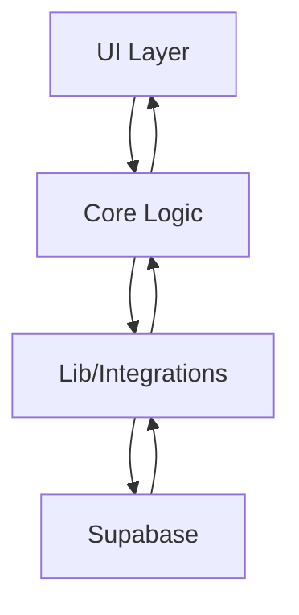

## Architecture Notes

The SaaS Valuation system is designed as a modular web application using Next.js, with a clear separation between UI components, domain logic, and infrastructure integrations. The architecture emphasizes maintainability, testability, and scalability, leveraging TypeScript for type safety and Supabase for backend services.

## System Architecture Overview

The application follows a modular monolith approach, where all core modules reside in a single codebase but are organized by domain and responsibility. User requests flow from the frontend (React/Next.js) through domain logic in `src/core/` and interact with Supabase for authentication, data persistence, and file storage. All business logic is isolated from infrastructure concerns.

## Architectural Layers

- **App Layer**: User interface and routing (`src/app/`, `src/components/`)
- **Core Layer**: Domain logic, calculations, and business rules (`src/core/`)
- **Lib Layer**: Utilities, integrations, and shared helpers (`src/lib/`)
- **Types Layer**: Shared type definitions (`src/types/`, `src/core/types/`)
- **Styles Layer**: Design system and global styles (`src/styles/`)

> See [`codebase-map.json`](./codebase-map.json) for complete symbol counts and dependency graphs.

## Detected Design Patterns

| Pattern        | Confidence | Locations                                  | Description                                     |
| -------------- | ---------- | ------------------------------------------ | ----------------------------------------------- |
| Modularization | High       | `src/core/`, `src/lib/`, `src/components/` | Separation of concerns by domain/responsibility |
| Adapter        | Medium     | `src/lib/supabase/`, `src/lib/actions/`    | Abstracts external service integration          |
| Factory        | Medium     | `src/lib/supabase/client.ts`, `server.ts`  | Creates configured Supabase clients             |
| Validation     | High       | `src/core/validators/`                     | Centralized input validation logic              |

## Entry Points

- [middleware.ts](../../middleware.ts)
- [src/app/layout.tsx](../../src/app/layout.tsx)
- [src/app/(auth)/login/page.tsx](<../../src/app/(auth)/login/page.tsx>)
- [src/app/(dashboard)/model/[id]/](<../../src/app/(dashboard)/model/[id]/>)

## Public API

| Symbol             | Type      | Location                                                                           |
| ------------------ | --------- | ---------------------------------------------------------------------------------- |
| ApiError           | type      | [src/types/index.ts](../../src/types/index.ts#L21)                                 |
| APIRequest         | type      | [src/core/types/index.ts](../../src/core/types/index.ts#L71)                       |
| ApiResponse        | type      | [src/types/index.ts](../../src/types/index.ts#L14)                                 |
| APIResponse        | type      | [src/core/types/index.ts](../../src/core/types/index.ts#L76)                       |
| AppSidebar         | component | [src/components/app-sidebar.tsx](../../src/components/app-sidebar.tsx#L159)        |
| Assumptions        | type      | [src/core/types/index.ts](../../src/core/types/index.ts#L49)                       |
| AuthSession        | type      | [src/types/user.ts](../../src/types/user.ts#L39)                                   |
| BalanceSheet       | type      | [src/types/financial.ts](../../src/types/financial.ts#L23)                         |
| BalanceSheet       | type      | [src/core/types/index.ts](../../src/core/types/index.ts#L27)                       |
| calculateValuation | function  | [src/core/calculations/valuation.ts](../../src/core/calculations/valuation.ts#L21) |
| calculateWACC      | function  | [src/core/calculations/wacc.ts](../../src/core/calculations/wacc.ts#L27)           |
| createClient       | function  | [src/lib/supabase/server.ts](../../src/lib/supabase/server.ts#L5)                  |
| createModel        | function  | [src/lib/actions/models.ts](../../src/lib/actions/models.ts#L122)                  |
| duplicateModel     | function  | [src/lib/actions/models.ts](../../src/lib/actions/models.ts#L275)                  |

## Internal System Boundaries

Domain logic in `src/core/` is decoupled from infrastructure and UI. Integrations with Supabase are abstracted in `src/lib/supabase/`. Shared types enforce contracts between layers.

## External Service Dependencies

- **Supabase**: Auth, database, and file storage. Uses JWT for authentication and SDK for API calls.

## Key Decisions & Trade-offs

- Chose modular monolith for simplicity and maintainability.
- TypeScript for type safety and developer tooling.
- Supabase for rapid backend provisioning and managed auth.

## Diagrams

## Risks & Constraints

- Scaling is limited by Supabase plan and Next.js serverless model.
- All operations are synchronous; no event-driven or queue-based processing.

## Top Directories Snapshot

- `src/app/` — UI, routing, and pages
- `src/components/` — UI components and layout
- `src/core/` — Domain logic and calculations
- `src/lib/` — Utilities and integrations
- `src/types/` — Shared type definitions
- `src/styles/` — Design system and global styles

## Related Resources

- [Project Overview](./project-overview.md)
- [Data Flow](./data-flow.md)
- [codebase-map.json](./codebase-map.json)
