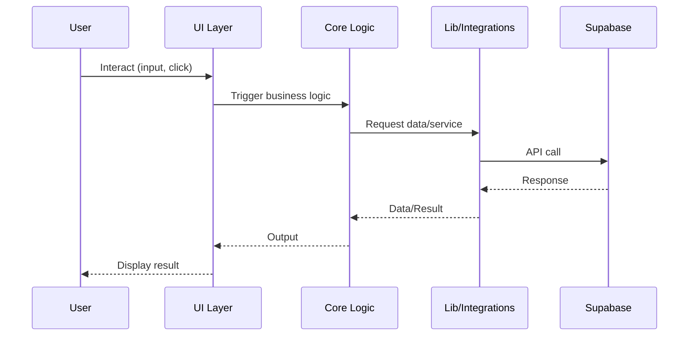

type: doc
name: data-flow
description: How data moves through the system and external integrations
category: data-flow
generated: 2026-01-24
status: unfilled
scaffoldVersion: "2.0.0"

## Data Flow & Integrations

Dados na aplicação SaaS Valuation fluem de interações do usuário no frontend, através da lógica de domínio, e para armazenamento persistente ou APIs externas. O sistema é projetado para manter a lógica de negócio isolada da infraestrutura, com limites claros entre módulos. Supabase é a integração externa primária, gerenciando autenticação, banco de dados e armazenamento.

## Module Dependencies

- **src/app/** → `core`, `components`, `lib`, `styles`
- **src/core/** → `lib`, `types`, `utils`
- **src/lib/** → `supabase`, `utils`
- **src/components/** → `ui`, `core`
- **src/styles/** → `design-system`

## Service Layer

- [src/core/company/](../../src/core/company/) — Serviços de domínio de empresa
- [src/core/financial/](../../src/core/financial/) — Serviços de dados financeiros
- [src/core/valuation/](../../src/core/valuation/) — Serviços de lógica de valuation
- [src/lib/supabase/server.ts](../../src/lib/supabase/server.ts) — Integração Supabase

## High-level Flow

Ações do usuário na UI disparam eventos que são tratados por componentes e roteados para lógica de domínio em `src/core/`. Esses módulos processam dados, aplicam regras de negócio e interagem com Supabase via camada de integração em `src/lib/supabase/`. Resultados são retornados para a UI para exibição ou ação adicional.

## Internal Movement

Módulos se comunicam via chamadas de função e tipos compartilhados. Não há filas de mensagens ou event buses presentes neste estágio; todas as operações são síncronas e em processo.

## External Integrations

- **Supabase**: Usado para autenticação (JWT), banco de dados (Postgres) e armazenamento de arquivos. Gerencia retries e erros via SDK. Payloads são codificados em JSON.

## Observability & Failure Modes

Logging e tratamento de erros são implementados na camada de integração. O SDK do Supabase fornece objetos de erro e códigos de status, que são exibidos na UI para feedback do usuário. Não há tracing distribuído ou observabilidade avançada implementada atualmente.

---

See also: [Architecture Notes](./architecture.md)
