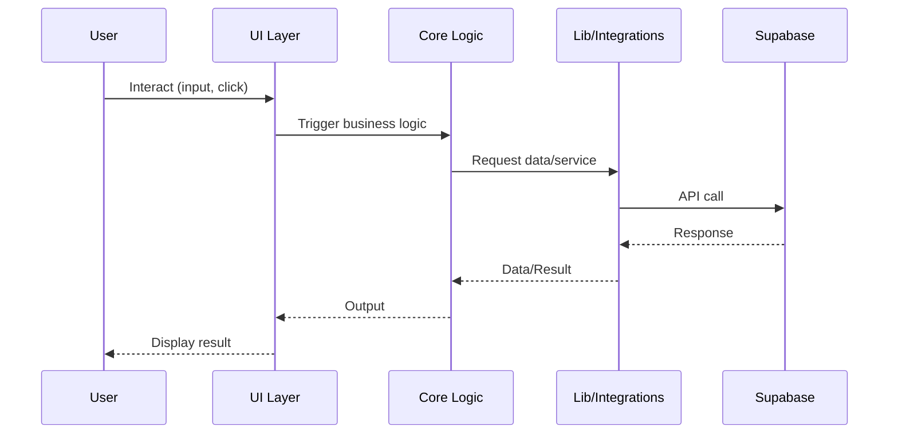

## Data Flow & Integrations

Data in the SaaS Valuation application flows from user interactions in the frontend, through domain logic, and to persistent storage or external APIs. The system is designed to keep business logic isolated from infrastructure, with clear module boundaries. Supabase is the primary external integration, handling authentication, database, and file storage.

## Module Dependencies

- **src/app/** → `core`, `components`, `lib`, `styles`
- **src/core/** → `lib`, `types`, `utils`
- **src/lib/** → `supabase`, `utils`
- **src/components/** → `ui`, `core`
- **src/styles/** → `design-system`

## Service Layer

- [src/core/company/](../../src/core/company/) — Company domain services
- [src/core/financial/](../../src/core/financial/) — Financial data services
- [src/core/valuation/](../../src/core/valuation/) — Valuation logic services
- [src/lib/supabase/server.ts](../../src/lib/supabase/server.ts) — Supabase integration

## High-level Flow

User actions in the UI trigger events handled by components and routed to domain logic in `src/core/`. These modules process data, apply business rules, and interact with Supabase via the integration layer in `src/lib/supabase/`. Results are returned to the UI for display or further action.

## Internal Movement

Modules communicate via function calls and shared types. There are no message queues or event buses at this stage; all operations are synchronous and in-process.

## External Integrations

- **Supabase**: Used for authentication (JWT), database (Postgres), and file storage. Handles retries and errors via SDK. Payloads are JSON-encoded.

## Observability & Failure Modes

Logging and error handling are implemented in the integration layer. The Supabase SDK provides error objects and status codes, which are surfaced in the UI for user feedback. No distributed tracing or advanced observability is currently implemented.

---

See also: [Architecture Notes](./architecture.md)
See also: [Architecture Notes](./architecture.md)
