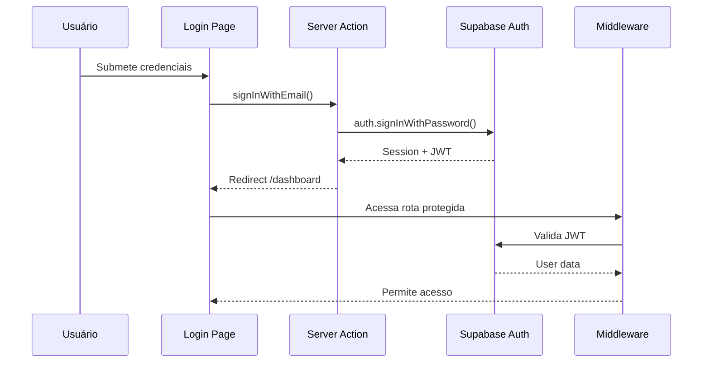

# How does authentication work?

## Visão Geral

O sistema de autenticação suporta **dois modos**:
- **Produção**: Supabase Auth (JWT + PostgreSQL)
- **Desenvolvimento**: Mock Auth (sessões em memória)

## Modo Produção (Supabase)

### Fluxo de Autenticação



### Implementação

**1. Login (`src/lib/actions/auth.ts`)**

```typescript
export async function signInWithEmail(email: string, password: string) {
  const supabase = await createClient()

  const { data, error } = await supabase.auth.signInWithPassword({
    email,
    password,
  })

  if (error) return { success: false, error: error.message }
  return { success: true, data }
}
```

**2. Middleware de Proteção (`middleware.ts`)**

```typescript
export async function middleware(request: NextRequest) {
  return await updateSession(request)
}

export const config = {
  matcher: [
    '/((?!_next/static|_next/image|favicon.ico|.*\\.(?:svg|png|jpg|jpeg|gif|webp)$).*)',
  ],
}
```

**3. Rotas Protegidas**

O middleware automaticamente:
- Redireciona usuários não autenticados para `/login`
- Valida e renova tokens JWT
- Permite acesso apenas a usuários autenticados

### Funcionalidades Disponíveis

✅ **Login com Email/Senha**
- Page: `src/app/(auth)/login/page.tsx`
- Action: `signInWithEmail()`

✅ **Signup (Cadastro)**
- Page: `src/app/(auth)/signup/page.tsx`
- Action: `signUpWithEmail()`

✅ **Esqueci Senha**
- Page: `src/app/(auth)/forgot-password/page.tsx`
- Action: `resetPasswordRequest()`
- Envia email com link de reset

✅ **Reset de Senha**
- Page: `src/app/(auth)/reset-password/page.tsx`
- Action: `resetPassword()`
- Valida token e atualiza senha

✅ **Logout**
- Action: `signOut()`
- Limpa sessão e cookies

## Modo Mock (Desenvolvimento)

### Ativação

Configure `.env.local`:
```env
NEXT_PUBLIC_USE_MOCK_DATA=true
```

### Usuários Pré-configurados

| Email | Senha | Nome | Role |
|-------|-------|------|------|
| `test@example.com` | `password123` | Test User | admin |
| `john@example.com` | `password123` | John Doe | user |
| `jane@example.com` | `password123` | Jane Smith | user |

### Implementação Mock

**Mock Auth Store (`src/lib/mock/auth.ts`)**

```typescript
// Autenticação simulada
export async function mockSignIn(email: string, password: string) {
  await simulateNetworkDelay(200)

  const user = mockUsers.find(u => u.email === email)
  if (!user || password !== 'password123') {
    throw new Error('Invalid credentials')
  }

  const session = createMockSession(user)
  sessionStore.set('current', session)
  return { user, session }
}
```

**Características:**
- ✅ Sessões em memória (não persiste entre refreshes)
- ✅ Validação de credenciais simulada
- ✅ Middleware compatível
- ✅ Mesmo fluxo de UI da produção
- ⚠️ Senha fixa: `password123` para todos

## Tipos e Interfaces

```typescript
// src/types/user.ts
export interface User {
  id: string
  email: string
  user_metadata: {
    full_name?: string
    avatar_url?: string
  }
  created_at: string
}

export interface AuthSession {
  user: User
  access_token: string
  refresh_token?: string
  expires_at?: number
}
```

## Helpers de Auth

```typescript
// Verificar se usuário está autenticado
import { getCurrentUser } from '@/lib/auth'

const user = await getCurrentUser()
if (!user) {
  redirect('/login')
}

// Proteger Server Actions
import { requireAuth } from '@/lib/auth'

export async function protectedAction() {
  const user = await requireAuth() // Throws se não autenticado
  // ... sua lógica
}
```

## Rotas Públicas vs Protegidas

### Públicas (sem autenticação)
- `/` - Landing page
- `/login` - Login
- `/signup` - Cadastro
- `/forgot-password` - Recuperação de senha
- `/reset-password` - Reset de senha

### Protegidas (requerem autenticação)
- `/dashboard` - Dashboard principal
- `/dashboard/models` - Lista de modelos
- `/model/[id]/*` - Visualização e edição de modelos
- `/model/new` - Criar novo modelo

## Segurança

### Tokens JWT (Supabase)
- **Expiração**: 1 hora (renovação automática)
- **Storage**: HTTP-only cookies
- **Validação**: Middleware em toda requisição

### Proteções Implementadas
- ✅ CSRF protection (Next.js built-in)
- ✅ HTTP-only cookies
- ✅ Secure cookies em produção (HTTPS)
- ✅ Rate limiting (Supabase)
- ✅ Validação de input

### Boas Práticas

❌ **Evite:**
```typescript
// Armazenar tokens no localStorage
localStorage.setItem('token', token) // INSEGURO
```

✅ **Prefira:**
```typescript
// Use server actions e cookies HTTP-only
const user = await getCurrentUser() // Seguro
```

## Debugging

### Verificar estado de autenticação

```typescript
// Em Server Component
import { getCurrentUser } from '@/lib/auth'

const user = await getCurrentUser()
console.log('Current user:', user)
```

### Logs do Middleware

```typescript
// middleware.ts
console.log('Request:', request.nextUrl.pathname)
console.log('User:', user ? user.email : 'not authenticated')
```

### Modo Mock Debug

```typescript
// src/lib/mock/config.ts
export const MOCK_CONFIG = {
  enableLogs: true, // Ativa logs detalhados
  simulateLatency: true,
  latencyMs: { min: 100, max: 300 }
}
```

## Troubleshooting

### "Unauthorized" em rotas protegidas

1. Verifique se está logado
2. Limpe cookies do navegador
3. Verifique se token não expirou
4. Em mock mode: sessão não persiste entre refreshes

### Redirect loop

- Middleware pode estar mal configurado
- Verifique matcher no `middleware.ts`
- Garanta que rotas de auth (`/login`, `/signup`) não estão protegidas

### Mock não funciona

- Confirme `NEXT_PUBLIC_USE_MOCK_DATA=true` em `.env.local`
- Reinicie o servidor
- Verifique console do navegador para erros