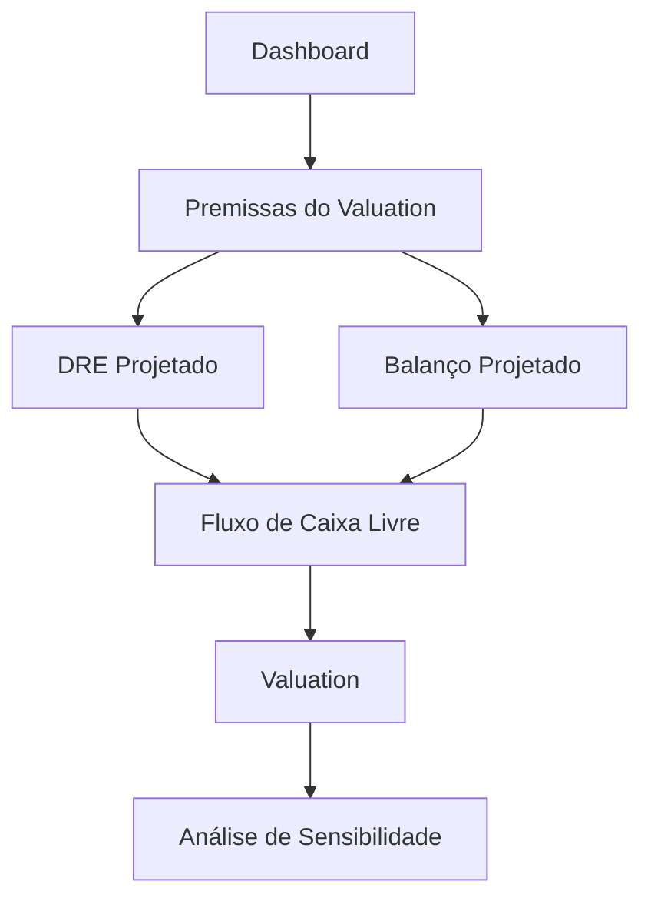

# Componentes de Interface do Usuário

Documentação completa dos principais componentes de UI da aplicação SaaS Valuation.

---

## 🎨 AppSidebar

**Arquivo:** `src/components/app-sidebar.tsx`

### Descrição

Componente principal de navegação lateral da aplicação. Responsável por exibir a navegação contextual, informações do usuário e organização. Adapta-se dinamicamente ao contexto da página.

### Características

- ✅ **Colapsável** - Pode ser recolhido para modo ícone
- ✅ **Contextual** - Muda de conteúdo dependendo da rota atual
- ✅ **Responsivo** - Adapta-se a diferentes tamanhos de tela
- ✅ **State-aware** - Detecta automaticamente se está em página de modelo

### Props

```typescript
interface AppSidebarProps extends React.ComponentProps<typeof Sidebar> {
  // Herda todas as props do componente Sidebar do shadcn/ui
}
```

### Estrutura

```tsx
<AppSidebar>
  <SidebarHeader>      {/* Logo e seletor de workspace */}
  <SidebarContent>     {/* Navegação principal ou navegação de modelo */}
  <SidebarFooter>      {/* Menu do usuário */}
  <SidebarRail>        {/* Barra de redimensionamento */}
</AppSidebar>
```

### Comportamento Dinâmico

#### Modo Dashboard (padrão)
Quando não está em uma página de modelo específico:
```tsx
<SidebarContent>
  <NavMain items={navItems} />  {/* Navegação principal */}
</SidebarContent>
```

**Navegação exibida:**
- 📊 **Valuations** - `/dashboard/models`
- ⚙️ **Configuração** - `/settings`
- 📥 **Exportação** - `/export`

#### Modo Modelo (contextual)
Quando está visualizando/editando um modelo (`/model/:id/*`):
```tsx
<SidebarContent>
  <ModelSidebarNav modelId={modelId} />  {/* Navegação do modelo */}
</SidebarContent>
```

**Navegação exibida:**
- 🏠 Dashboard
- 💾 Premissas do Valuation
- 📄 DRE Projetado
- ⚖️ Balanço Projetado
- 📈 Fluxo de Caixa Livre
- 📊 Valuation
- 🔬 Análise de Sensibilidade

### Detecção de Contexto

```typescript
const pathname = usePathname();

// Regex para extrair ID do modelo da URL
const modelIdMatch = pathname?.match(/\/model\/([^\/]+)/);
const modelId = modelIdMatch?.[1];

// Não considera /model/new como visualização de modelo
const isModelView = !!modelId && modelId !== "new";
```

### Exemplo de Uso

```tsx
import { AppSidebar } from '@/components/app-sidebar';
import { SidebarProvider, SidebarInset } from '@/components/ui/sidebar';

export default function Layout({ children }) {
  return (
    <SidebarProvider>
      <AppSidebar />
      <SidebarInset>
        {children}
      </SidebarInset>
    </SidebarProvider>
  );
}
```

### Configuração de Dados

```typescript
const data = {
  user: {
    name: "shadcn",
    email: "m@example.com",
    avatar: "/avatars/shadcn.jpg",
  },
  teams: [
    {
      name: "SaaS Valuation",
      logo: GalleryVerticalEnd,
      plan: "Professional",
    },
  ],
  navMain: [
    {
      title: "Valuations",
      url: "/dashboard/models",
      icon: BarChart3,
      isActive: true,
    },
    // ...
  ],
};
```

---

## 🧭 NavMain

**Arquivo:** `src/components/nav-main.tsx`

### Descrição

Componente de navegação principal com suporte a itens colapsáveis e hierárquicos.

### Props

```typescript
interface NavMainProps {
  items: {
    title: string;
    url: string;
    icon?: LucideIcon;
    isActive?: boolean;
    items?: {              // Subitens opcionais
      title: string;
      url: string;
    }[];
  }[];
}
```

### Características

- ✅ Suporte a **navegação hierárquica** (itens + subitens)
- ✅ Itens **colapsáveis** com animação
- ✅ **Ícones** do Lucide React
- ✅ **Tooltips** automáticos quando sidebar está colapsado
- ✅ Estado **isActive** para expandir automaticamente

### Comportamento

#### Item Simples (sem subitens)
```tsx
<SidebarMenuButton asChild>
  <a href={item.url}>
    {item.icon && <item.icon />}
    <span>{item.title}</span>
  </a>
</SidebarMenuButton>
```

#### Item com Subitens (colapsável)
```tsx
<Collapsible defaultOpen={item.isActive}>
  <CollapsibleTrigger>
    {item.icon && <item.icon />}
    <span>{item.title}</span>
    <ChevronRight />  {/* Rotaciona ao expandir */}
  </CollapsibleTrigger>
  <CollapsibleContent>
    <SidebarMenuSub>
      {/* Subitens renderizados aqui */}
    </SidebarMenuSub>
  </CollapsibleContent>
</Collapsible>
```

### Exemplo de Uso

```tsx
const navItems = [
  {
    title: "Analytics",
    icon: BarChart3,
    isActive: true,
    items: [
      { title: "Overview", url: "/analytics" },
      { title: "Reports", url: "/analytics/reports" },
    ],
  },
  {
    title: "Settings",
    icon: Settings2,
    url: "/settings",
  },
];

<NavMain items={navItems} />
```

---

## 👤 NavUser

**Arquivo:** `src/components/nav-user.tsx`

### Descrição

Menu dropdown do usuário com informações de perfil e ações de conta.

### Props

```typescript
interface NavUserProps {
  user: {
    name: string;
    email: string;
    avatar: string;
  };
}
```

### Características

- ✅ **Avatar** do usuário com fallback
- ✅ **Dropdown menu** com ações
- ✅ **Responsivo** - Posicionamento adaptativo mobile/desktop
- ✅ **Informações** do usuário (nome e email)

### Menu de Ações

**Upgrade:**
- ✨ Upgrade to Pro

**Conta:**
- ✅ Account
- 💳 Billing
- 🔔 Notifications

**Sessão:**
- 🚪 Log out

### Comportamento Responsivo

```typescript
const { isMobile } = useSidebar();

<DropdownMenuContent
  side={isMobile ? "bottom" : "right"}
  align="end"
>
```

- **Desktop**: Menu abre à direita
- **Mobile**: Menu abre abaixo

### Fallback de Avatar

```tsx
<Avatar>
  <AvatarImage src={user.avatar} alt={user.name} />
  <AvatarFallback>CN</AvatarFallback>  {/* Exibido se imagem falhar */}
</Avatar>
```

### Exemplo de Uso

```tsx
const user = {
  name: "João Silva",
  email: "joao@example.com",
  avatar: "/avatars/joao.jpg"
};

<NavUser user={user} />
```

---

## 🏢 TeamSwitcher

**Arquivo:** `src/components/team-switcher.tsx`

### Descrição

Componente para alternar entre diferentes workspaces/organizações (teams).

### Props

```typescript
interface TeamSwitcherProps {
  teams: {
    name: string;
    logo: React.ElementType;  // Componente de ícone
    plan: string;
  }[];
}
```

### Características

- ✅ **Seletor de workspace** ativo
- ✅ **Estado local** com React.useState
- ✅ **Dropdown menu** com lista de times
- ✅ **Atalhos de teclado** (⌘1, ⌘2, etc.)
- ✅ **Ação de adicionar** novo time

### Estado

```typescript
const [activeTeam, setActiveTeam] = React.useState(teams[0]);
```

### Menu de Opções

```tsx
<DropdownMenuContent>
  <DropdownMenuLabel>Teams</DropdownMenuLabel>

  {/* Lista de times */}
  {teams.map((team, index) => (
    <DropdownMenuItem onClick={() => setActiveTeam(team)}>
      <team.logo />
      {team.name}
      <DropdownMenuShortcut>⌘{index + 1}</DropdownMenuShortcut>
    </DropdownMenuItem>
  ))}

  {/* Adicionar novo time */}
  <DropdownMenuItem>
    <Plus /> Add team
  </DropdownMenuItem>
</DropdownMenuContent>
```

### Exemplo de Uso

```tsx
const teams = [
  {
    name: "SaaS Valuation",
    logo: GalleryVerticalEnd,
    plan: "Professional"
  },
  {
    name: "My Startup",
    logo: Building2,
    plan: "Free"
  }
];

<TeamSwitcher teams={teams} />
```

---

## 📊 ModelSidebarNav

**Arquivo:** `src/components/model-sidebar-nav.tsx`

### Descrição

Navegação específica para páginas de visualização/edição de modelos financeiros. Exibida quando o usuário está trabalhando em um modelo específico.

### Props

```typescript
interface ModelSidebarNavProps {
  modelId: string;  // UUID do modelo
}
```

### Características

- ✅ **Navegação contextual** para modelos
- ✅ **Highlight automático** da rota ativa
- ✅ **Links dinâmicos** baseados no modelId
- ✅ **Ícones descritivos** para cada seção

### Navegação Disponível

```typescript
const navigation: NavItem[] = [
  {
    title: 'Dashboard',
    icon: Home,
    url: '/dashboard',
  },
  {
    title: 'Premissas do Valuation',
    icon: Database,
    url: `/model/${modelId}/input/base`,
  },
  {
    title: 'DRE Projetado',
    icon: FileText,
    url: `/model/${modelId}/view/dre`,
  },
  {
    title: 'Balanço Projetado',
    icon: Scale,
    url: `/model/${modelId}/view/balance-sheet`,
  },
  {
    title: 'Fluxo de Caixa Livre',
    icon: TrendingUp,
    url: `/model/${modelId}/view/fcff`,
  },
  {
    title: 'Valuation',
    icon: BarChart3,
    url: `/model/${modelId}/view/valuation`,
  },
  {
    title: 'Análise de Sensibilidade',
    icon: Activity,
    url: `/model/${modelId}/sensitivity`,
  },
];
```

### Detecção de Rota Ativa

```typescript
const pathname = usePathname();

<SidebarMenuButton
  asChild
  isActive={pathname === item.url}  // Highlight automático
>
  <Link href={item.url}>
    <item.icon />
    <span>{item.title}</span>
  </Link>
</SidebarMenuButton>
```

### Fluxo de Navegação



### Exemplo de Uso

```tsx
// Em /model/[id]/layout.tsx
<AppSidebar />  {/* Detecta automaticamente o modelId e renderiza ModelSidebarNav */}
```

---

## 🎨 Componentes Base (shadcn/ui)

Todos os componentes de sidebar utilizam os componentes base do **shadcn/ui**:

### Sidebar (Componente Base)

```typescript
import {
  Sidebar,
  SidebarContent,
  SidebarFooter,
  SidebarHeader,
  SidebarRail,
  SidebarGroup,
  SidebarMenu,
  SidebarMenuButton,
  SidebarMenuItem,
  SidebarMenuSub,
  SidebarMenuSubButton,
  SidebarMenuSubItem,
} from "@/components/ui/sidebar";
```

### Características dos Componentes Base

- ✅ **Acessibilidade** WAI-ARIA completa
- ✅ **Temas** com CSS variables
- ✅ **Animações** suaves com Tailwind
- ✅ **Composição** modular
- ✅ **Type-safe** com TypeScript

### SidebarProvider

```tsx
<SidebarProvider>
  <AppSidebar />
  <SidebarInset>
    {children}
  </SidebarInset>
</SidebarProvider>
```

**Funcionalidades:**
- Estado de colapsado/expandido
- Detecção de mobile
- Gerenciamento de largura
- Persistência de estado (localStorage)

---

## 🔧 Customização

### Adicionar Novo Item de Navegação

**1. Para navegação principal:**

```typescript
// Em app-sidebar.tsx
const data = {
  navMain: [
    // ...itens existentes
    {
      title: "Novo Item",
      url: "/novo-item",
      icon: NewIcon,
      isActive: false,
    },
  ],
};
```

**2. Para navegação de modelo:**

```typescript
// Em model-sidebar-nav.tsx
const navigation: NavItem[] = [
  // ...itens existentes
  {
    title: 'Nova Seção',
    icon: NewIcon,
    url: `/model/${modelId}/nova-secao`,
  },
];
```

### Estilização

Todos os componentes respeitam as CSS variables do tema:

```css
--sidebar-background
--sidebar-foreground
--sidebar-primary
--sidebar-primary-foreground
--sidebar-accent
--sidebar-accent-foreground
--sidebar-border
```

### Ícones

Utilizamos **Lucide React** para ícones:

```typescript
import { IconName } from "lucide-react";
```

**Ícones disponíveis:** https://lucide.dev/icons

---

## 📱 Responsividade

### Breakpoints

```typescript
const { isMobile } = useSidebar();

// isMobile = true quando largura < 768px
```

### Comportamento Mobile

- **Sidebar colapsada** por padrão
- **Overlay** ao expandir
- **Menus dropdown** abrem para baixo (não para o lado)
- **Touch-friendly** com áreas de toque maiores

---

## ♿ Acessibilidade

### Recursos de A11y

- ✅ **Navegação por teclado** completa
- ✅ **Screen readers** com labels apropriados
- ✅ **Focus management** adequado
- ✅ **ARIA attributes** corretos
- ✅ **Contraste de cores** WCAG AA

### Atalhos de Teclado

| Atalho | Ação |
|--------|------|
| `⌘B` | Toggle sidebar |
| `⌘K` | Busca rápida |
| `⌘1-9` | Alternar entre teams |
| `Tab` | Navegar entre itens |
| `Enter` | Ativar item focado |
| `Space` | Expandir/colapsar item |

---

## 🧪 Testes

### Testar Navegação Contextual

```typescript
// Verificar se exibe NavMain no dashboard
expect(screen.getByText('Valuations')).toBeInTheDocument();

// Verificar se exibe ModelSidebarNav em /model/:id
expect(screen.getByText('DRE Projetado')).toBeInTheDocument();
```

### Testar Estado de Ativo

```typescript
const { container } = render(<ModelSidebarNav modelId="123" />);
const activeLink = container.querySelector('[data-active="true"]');
expect(activeLink).toHaveAttribute('href', '/model/123/view/dre');
```

---

## 📚 Ver Também

- [Architecture Overview](../architecture.md)
- [Routing](./routing.md)
- [Componentes UI Base (shadcn/ui)](https://ui.shadcn.com)
- [Lucide Icons](https://lucide.dev)
- [Radix UI](https://www.radix-ui.com/)
