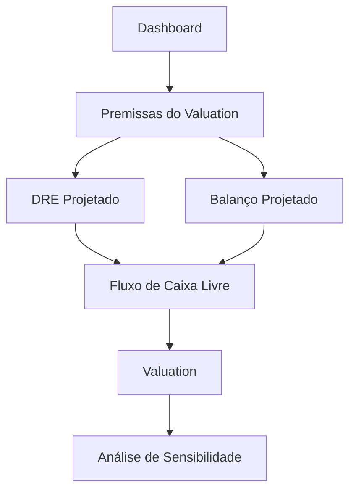

# Componentes de Interface do Usuário

Documentação completa dos principais componentes de UI da aplicação SaaS Valuation.

---

## 🎨 AppSidebar

**Arquivo:** `src/components/app-sidebar.tsx`

### Descrição

Componente principal de navegação lateral da aplicação. Responsável por exibir a navegação contextual, informações do usuário e organização. Adapta-se dinamicamente ao contexto da página.

### Características

- ✅ **Colapsável** - Pode ser recolhido para modo ícone
- ✅ **Contextual** - Muda de conteúdo dependendo da rota atual
- ✅ **Responsivo** - Adapta-se a diferentes tamanhos de tela
- ✅ **State-aware** - Detecta automaticamente se está em página de modelo

### Props

```typescript
interface AppSidebarProps extends React.ComponentProps<typeof Sidebar> {
  // Herda todas as props do componente Sidebar do shadcn/ui
}
```

### Estrutura

```tsx
<AppSidebar>
  <SidebarHeader>      {/* Logo e seletor de workspace */}
  <SidebarContent>     {/* Navegação principal ou navegação de modelo */}
  <SidebarFooter>      {/* Menu do usuário */}
  <SidebarRail>        {/* Barra de redimensionamento */}
</AppSidebar>
```

### Comportamento Dinâmico

#### Modo Dashboard (padrão)
Quando não está em uma página de modelo específico:
```tsx
<SidebarContent>
  <NavMain items={navItems} />  {/* Navegação principal */}
</SidebarContent>
```

**Navegação exibida:**
- 📊 **Valuations** - `/dashboard/models`
- ⚙️ **Configuração** - `/settings`
- 📥 **Exportação** - `/export`

#### Modo Modelo (contextual)
Quando está visualizando/editando um modelo (`/model/:id/*`):
```tsx
<SidebarContent>
  <ModelSidebarNav modelId={modelId} />  {/* Navegação do modelo */}
</SidebarContent>
```

**Navegação exibida:**
- 🏠 Dashboard
- 💾 Premissas do Valuation
- 📄 DRE Projetado
- ⚖️ Balanço Projetado
- 📈 Fluxo de Caixa Livre
- 📊 Valuation
- 🔬 Análise de Sensibilidade

### Detecção de Contexto

```typescript
const pathname = usePathname();

// Regex para extrair ID do modelo da URL
const modelIdMatch = pathname?.match(/\/model\/([^\/]+)/);
const modelId = modelIdMatch?.[1];

// Não considera /model/new como visualização de modelo
const isModelView = !!modelId && modelId !== "new";
```

### Exemplo de Uso

```tsx
import { AppSidebar } from '@/components/app-sidebar';
import { SidebarProvider, SidebarInset } from '@/components/ui/sidebar';

export default function Layout({ children }) {
  return (
    <SidebarProvider>
      <AppSidebar />
      <SidebarInset>
        {children}
      </SidebarInset>
    </SidebarProvider>
  );
}
```

### Configuração de Dados

```typescript
const data = {
  user: {
    name: "shadcn",
    email: "m@example.com",
    avatar: "/avatars/shadcn.jpg",
  },
  teams: [
    {
      name: "SaaS Valuation",
      logo: GalleryVerticalEnd,
      plan: "Professional",
    },
  ],
  navMain: [
    {
      title: "Valuations",
      url: "/dashboard/models",
      icon: BarChart3,
      isActive: true,
    },
    // ...
  ],
};
```

---

## 🧭 NavMain

**Arquivo:** `src/components/nav-main.tsx`

### Descrição

Componente de navegação principal com suporte a itens colapsáveis e hierárquicos.

### Props

```typescript
interface NavMainProps {
  items: {
    title: string;
    url: string;
    icon?: LucideIcon;
    isActive?: boolean;
    items?: {              // Subitens opcionais
      title: string;
      url: string;
    }[];
  }[];
}
```

### Características

- ✅ Suporte a **navegação hierárquica** (itens + subitens)
- ✅ Itens **colapsáveis** com animação
- ✅ **Ícones** do Lucide React
- ✅ **Tooltips** automáticos quando sidebar está colapsado
- ✅ Estado **isActive** para expandir automaticamente

### Comportamento

#### Item Simples (sem subitens)
```tsx
<SidebarMenuButton asChild>
  <a href={item.url}>
    {item.icon && <item.icon />}
    <span>{item.title}</span>
  </a>
</SidebarMenuButton>
```

#### Item com Subitens (colapsável)
```tsx
<Collapsible defaultOpen={item.isActive}>
  <CollapsibleTrigger>
    {item.icon && <item.icon />}
    <span>{item.title}</span>
    <ChevronRight />  {/* Rotaciona ao expandir */}
  </CollapsibleTrigger>
  <CollapsibleContent>
    <SidebarMenuSub>
      {/* Subitens renderizados aqui */}
    </SidebarMenuSub>
  </CollapsibleContent>
</Collapsible>
```

### Exemplo de Uso

```tsx
const navItems = [
  {
    title: "Analytics",
    icon: BarChart3,
    isActive: true,
    items: [
      { title: "Overview", url: "/analytics" },
      { title: "Reports", url: "/analytics/reports" },
    ],
  },
  {
    title: "Settings",
    icon: Settings2,
    url: "/settings",
  },
];

<NavMain items={navItems} />
```

---

## 👤 NavUser

**Arquivo:** `src/components/nav-user.tsx`

### Descrição

Menu dropdown do usuário com informações de perfil e ações de conta.

### Props

```typescript
interface NavUserProps {
  user: {
    name: string;
    email: string;
    avatar: string;
  };
}
```

### Características

- ✅ **Avatar** do usuário com fallback
- ✅ **Dropdown menu** com ações
- ✅ **Responsivo** - Posicionamento adaptativo mobile/desktop
- ✅ **Informações** do usuário (nome e email)

### Menu de Ações

**Upgrade:**
- ✨ Upgrade to Pro

**Conta:**
- ✅ Account
- 💳 Billing
- 🔔 Notifications

**Sessão:**
- 🚪 Log out

### Comportamento Responsivo

```typescript
const { isMobile } = useSidebar();

<DropdownMenuContent
  side={isMobile ? "bottom" : "right"}
  align="end"
>
```

- **Desktop**: Menu abre à direita
- **Mobile**: Menu abre abaixo

### Fallback de Avatar

```tsx
<Avatar>
  <AvatarImage src={user.avatar} alt={user.name} />
  <AvatarFallback>CN</AvatarFallback>  {/* Exibido se imagem falhar */}
</Avatar>
```

### Exemplo de Uso

```tsx
const user = {
  name: "João Silva",
  email: "joao@example.com",
  avatar: "/avatars/joao.jpg"
};

<NavUser user={user} />
```

---

## 🏢 TeamSwitcher

**Arquivo:** `src/components/team-switcher.tsx`

### Descrição

Componente para alternar entre diferentes workspaces/organizações (teams).

### Props

```typescript
interface TeamSwitcherProps {
  teams: {
    name: string;
    logo: React.ElementType;  // Componente de ícone
    plan: string;
  }[];
}
```

### Características

- ✅ **Seletor de workspace** ativo
- ✅ **Estado local** com React.useState
- ✅ **Dropdown menu** com lista de times
- ✅ **Atalhos de teclado** (⌘1, ⌘2, etc.)
- ✅ **Ação de adicionar** novo time

### Estado

```typescript
const [activeTeam, setActiveTeam] = React.useState(teams[0]);
```

### Menu de Opções

```tsx
<DropdownMenuContent>
  <DropdownMenuLabel>Teams</DropdownMenuLabel>

  {/* Lista de times */}
  {teams.map((team, index) => (
    <DropdownMenuItem onClick={() => setActiveTeam(team)}>
      <team.logo />
      {team.name}
      <DropdownMenuShortcut>⌘{index + 1}</DropdownMenuShortcut>
    </DropdownMenuItem>
  ))}

  {/* Adicionar novo time */}
  <DropdownMenuItem>
    <Plus /> Add team
  </DropdownMenuItem>
</DropdownMenuContent>
```

### Exemplo de Uso

```tsx
const teams = [
  {
    name: "SaaS Valuation",
    logo: GalleryVerticalEnd,
    plan: "Professional"
  },
  {
    name: "My Startup",
    logo: Building2,
    plan: "Free"
  }
];

<TeamSwitcher teams={teams} />
```

---

## 📊 ModelSidebarNav

**Arquivo:** `src/components/model-sidebar-nav.tsx`

### Descrição

Navegação específica para páginas de visualização/edição de modelos financeiros. Exibida quando o usuário está trabalhando em um modelo específico.

### Props

```typescript
interface ModelSidebarNavProps {
  modelId: string;  // UUID do modelo
}
```

### Características

- ✅ **Navegação contextual** para modelos
- ✅ **Highlight automático** da rota ativa
- ✅ **Links dinâmicos** baseados no modelId
- ✅ **Ícones descritivos** para cada seção

### Navegação Disponível

```typescript
const navigation: NavItem[] = [
  {
    title: 'Dashboard',
    icon: Home,
    url: '/dashboard',
  },
  {
    title: 'Premissas do Valuation',
    icon: Database,
    url: `/model/${modelId}/input/base`,
  },
  {
    title: 'DRE Projetado',
    icon: FileText,
    url: `/model/${modelId}/view/dre`,
  },
  {
    title: 'Balanço Projetado',
    icon: Scale,
    url: `/model/${modelId}/view/balance-sheet`,
  },
  {
    title: 'Fluxo de Caixa Livre',
    icon: TrendingUp,
    url: `/model/${modelId}/view/fcff`,
  },
  {
    title: 'Valuation',
    icon: BarChart3,
    url: `/model/${modelId}/view/valuation`,
  },
  {
    title: 'Análise de Sensibilidade',
    icon: Activity,
    url: `/model/${modelId}/sensitivity`,
  },
];
```

### Detecção de Rota Ativa

```typescript
const pathname = usePathname();

<SidebarMenuButton
  asChild
  isActive={pathname === item.url}  // Highlight automático
>
  <Link href={item.url}>
    <item.icon />
    <span>{item.title}</span>
  </Link>
</SidebarMenuButton>
```

### Fluxo de Navegação



### Exemplo de Uso

```tsx
// Em /model/[id]/layout.tsx
<AppSidebar />  {/* Detecta automaticamente o modelId e renderiza ModelSidebarNav */}
```

---

## 🎨 Componentes Base (shadcn/ui)

Todos os componentes de sidebar utilizam os componentes base do **shadcn/ui**:

### Sidebar (Componente Base)

```typescript
import {
  Sidebar,
  SidebarContent,
  SidebarFooter,
  SidebarHeader,
  SidebarRail,
  SidebarGroup,
  SidebarMenu,
  SidebarMenuButton,
  SidebarMenuItem,
  SidebarMenuSub,
  SidebarMenuSubButton,
  SidebarMenuSubItem,
} from "@/components/ui/sidebar";
```

### Características dos Componentes Base

- ✅ **Acessibilidade** WAI-ARIA completa
- ✅ **Temas** com CSS variables
- ✅ **Animações** suaves com Tailwind
- ✅ **Composição** modular
- ✅ **Type-safe** com TypeScript

### SidebarProvider

```tsx
<SidebarProvider>
  <AppSidebar />
  <SidebarInset>
    {children}
  </SidebarInset>
</SidebarProvider>
```

**Funcionalidades:**
- Estado de colapsado/expandido
- Detecção de mobile
- Gerenciamento de largura
- Persistência de estado (localStorage)

---

## 🔧 Customização

### Adicionar Novo Item de Navegação

**1. Para navegação principal:**

```typescript
// Em app-sidebar.tsx
const data = {
  navMain: [
    // ...itens existentes
    {
      title: "Novo Item",
      url: "/novo-item",
      icon: NewIcon,
      isActive: false,
    },
  ],
};
```

**2. Para navegação de modelo:**

```typescript
// Em model-sidebar-nav.tsx
const navigation: NavItem[] = [
  // ...itens existentes
  {
    title: 'Nova Seção',
    icon: NewIcon,
    url: `/model/${modelId}/nova-secao`,
  },
];
```

### Estilização

Todos os componentes respeitam as CSS variables do tema:

```css
--sidebar-background
--sidebar-foreground
--sidebar-primary
--sidebar-primary-foreground
--sidebar-accent
--sidebar-accent-foreground
--sidebar-border
```

### Ícones

Utilizamos **Lucide React** para ícones:

```typescript
import { IconName } from "lucide-react";
```

**Ícones disponíveis:** https://lucide.dev/icons

---

## 📱 Responsividade

### Breakpoints

```typescript
const { isMobile } = useSidebar();

// isMobile = true quando largura < 768px
```

### Comportamento Mobile

- **Sidebar colapsada** por padrão
- **Overlay** ao expandir
- **Menus dropdown** abrem para baixo (não para o lado)
- **Touch-friendly** com áreas de toque maiores

---

## ♿ Acessibilidade

### Recursos de A11y

- ✅ **Navegação por teclado** completa
- ✅ **Screen readers** com labels apropriados
- ✅ **Focus management** adequado
- ✅ **ARIA attributes** corretos
- ✅ **Contraste de cores** WCAG AA

### Atalhos de Teclado

| Atalho | Ação |
|--------|------|
| `⌘B` | Toggle sidebar |
| `⌘K` | Busca rápida |
| `⌘1-9` | Alternar entre teams |
| `Tab` | Navegar entre itens |
| `Enter` | Ativar item focado |
| `Space` | Expandir/colapsar item |

---

## 🧪 Testes

### Testar Navegação Contextual

```typescript
// Verificar se exibe NavMain no dashboard
expect(screen.getByText('Valuations')).toBeInTheDocument();

// Verificar se exibe ModelSidebarNav em /model/:id
expect(screen.getByText('DRE Projetado')).toBeInTheDocument();
```

### Testar Estado de Ativo

```typescript
const { container } = render(<ModelSidebarNav modelId="123" />);
const activeLink = container.querySelector('[data-active="true"]');
expect(activeLink).toHaveAttribute('href', '/model/123/view/dre');
```

---

## 💰 FinancialInput

**Arquivo:** `src/components/ui/financial-input.tsx`

### Descrição

Componente especializado para entrada de valores monetários com formatação automática em tempo real seguindo padrão brasileiro (pt-BR).

### Características

- ✅ **Formatação automática** - Aplica separadores de milhar e decimais pt-BR
- ✅ **Prefixo R$** - Exibe símbolo de moeda
- ✅ **Parse bidirecional** - Converte entre string formatada e número
- ✅ **Sincronização inteligente** - Atualiza apenas quando não está em foco
- ✅ **Validação** - Suporte a required e disabled
- ✅ **Acessibilidade** - Label associado e ARIA attributes

### Props

```typescript
interface FinancialInputProps {
  id: string;                    // ID do input (para label)
  label: string;                 // Label descritivo
  value: number;                 // Valor numérico atual
  onChange: (value: string) => void;  // Callback com valor raw
  required?: boolean;            // Campo obrigatório (padrão: false)
  disabled?: boolean;            // Campo desabilitado (padrão: false)
  placeholder?: string;          // Placeholder (padrão: "0,00")
  className?: string;            // Classes CSS adicionais
}
```

### Comportamento

#### Estado de Formatação

```typescript
// Valor interno (display)
const [displayValue, setDisplayValue] = useState(() => formatInputNumber(value));
const [isFocused, setIsFocused] = useState(false);
```

**Durante edição (focado)**:
- Aceita entrada livre do usuário
- Não aplica formatação automática
- Permite digitação fluida

**Após perder foco (blur)**:
- Aplica formatação completa
- Normaliza separadores
- Adiciona casas decimais se necessário

#### Sincronização de Valores

```typescript
// Sincroniza com valor externo apenas quando não está em foco
useEffect(() => {
  if (!isFocused) {
    setDisplayValue(formatInputNumber(value));
  }
}, [value, isFocused]);
```

**Evita conflitos** entre:
- Edição manual do usuário
- Atualizações externas de valor

### Funções de Formatação

**formatInputNumber**:
```typescript
formatInputNumber(1234567.89)  // "1.234.567,89"
formatInputNumber(0)           // "0,00"
formatInputNumber(null)        // ""
```

**parseInputNumber**:
```typescript
parseInputNumber("1.234.567,89")  // 1234567.89
parseInputNumber("1.000")         // 1000
parseInputNumber("")              // 0
```

### Exemplo de Uso

```tsx
import { FinancialInput } from '@/components/ui/financial-input';
import { useState } from 'react';

function DREForm() {
  const [receita, setReceita] = useState(0);

  return (
    <FinancialInput
      id="receita"
      label="Receita Líquida"
      value={receita}
      onChange={(rawValue) => {
        const parsed = parseInputNumber(rawValue);
        setReceita(parsed);
      }}
      required
    />
  );
}
```

### Integração com React Hook Form

```tsx
import { useForm } from 'react-hook-form';
import { FinancialInput } from '@/components/ui/financial-input';
import { parseInputNumber } from '@/lib/utils/formatters';

function DREForm() {
  const { watch, setValue } = useForm();
  const receita = watch('receita', 0);

  return (
    <FinancialInput
      id="receita"
      label="Receita Líquida"
      value={receita}
      onChange={(raw) => setValue('receita', parseInputNumber(raw))}
      required
    />
  );
}
```

### Layout do Componente

```tsx
<div className="flex items-center justify-between gap-4">
  <Label htmlFor={id}>
    {label}
    {required && <span className="text-destructive ml-1">*</span>}
  </Label>
  <div className="relative w-35">
    <span className="absolute left-3 top-1/2 -translate-y-1/2">
      R$
    </span>
    <Input
      type="text"
      value={displayValue}
      className="pl-8 h-9 text-right"  {/* Alinhado à direita */}
    />
  </div>
</div>
```

### Estilização

- **Prefixo R$** - Posicionado absolutamente à esquerda
- **Input** - Alinhado à direita (padrão financeiro)
- **Largura fixa** - `w-35` para consistência
- **Altura compacta** - `h-9` para densidade visual

---

## 📊 PremiseInput

**Arquivo:** `src/components/tables/PremiseInput.tsx`

### Descrição

Componente especializado para entrada de premissas de projeção (valores percentuais) com funcionalidades avançadas de UX. Usado principalmente no DRETable para edição inline de premissas de crescimento, margens e taxas.

### Características

- ✅ **Input não-controlado** - Usa `defaultValue` + `key` para evitar re-renders durante digitação
- ✅ **Formatação percentual** - Exibe valores com 2 casas decimais + sufixo "%"
- ✅ **Validação automática** - Clamp entre 0-100% no blur
- ✅ **Copiar para direita** - Botão para replicar valor do Ano 1 para todos os anos
- ✅ **Aplicar tendência** - Popover com interpolação linear entre valor inicial e final
- ✅ **Navegação por teclado** - Tab, Shift+Tab, Enter, Escape para navegação eficiente
- ✅ **Tooltips informativos** - Explicações contextuais para cada funcionalidade
- ✅ **Ref forwarding** - Expõe HTMLInputElement para navegação programática

### Props

```typescript
interface PremiseInputProps {
  value: number | null;              // Valor atual (0-100)
  onChange: (value: number) => void; // Callback quando valor muda (no blur)
  onBlur?: () => void;               // Callback adicional no blur
  disabled?: boolean;                // Desabilita input e botões
  tabIndex?: number;                 // Ordem de tabulação
  className?: string;                // Classes CSS adicionais

  // Funcionalidade "Copiar para direita"
  showCopyRight?: boolean;           // Mostra botão ChevronsRight
  onCopyRight?: () => void;          // Callback ao clicar em copiar

  // Funcionalidade "Aplicar tendência"
  showTrend?: boolean;               // Mostra botão TrendingUp
  onApplyTrend?: (startValue: number, endValue: number) => void;

  // Navegação por teclado
  onNavigateNext?: () => void;       // Tab - próximo input (mesma linha)
  onNavigatePrevious?: () => void;   // Shift+Tab - input anterior
  onNavigateDown?: () => void;       // Enter - input abaixo (mesma coluna)
}
```

### Comportamento de Input

#### Input Não-Controlado

```typescript
<input
  ref={inputRef}
  key={formatted}  // ← Re-monta input quando valor externo muda
  defaultValue={formatted}  // ← Não re-renderiza durante digitação
  onBlur={handleBlur}
/>
```

**Vantagens**:
- ✅ Evita re-renders durante digitação
- ✅ Previne loops de unmount/remount do react-table
- ✅ Melhor performance com grandes tabelas
- ✅ Experiência de digitação mais fluida

#### Validação no Blur

```typescript
const handleBlur = (e: React.FocusEvent<HTMLInputElement>) => {
  const raw = e.target.value.replace(',', '.');
  const numValue = parseFloat(raw);
  if (!isNaN(numValue)) {
    const clamped = Math.max(0, Math.min(100, numValue));  // Clamp 0-100
    onChange(clamped);
    e.target.value = clamped.toFixed(2);
  } else {
    e.target.value = formatted;  // Restaura valor original se inválido
  }
};
```

### Funcionalidades de UX

#### 1. Copiar para Direita

Botão **ChevronsRight** que replica o valor do Ano 1 para todos os anos seguintes.

```tsx
{showCopyRight && onCopyRight && (
  <TooltipProvider>
    <Tooltip>
      <TooltipTrigger asChild>
        <Button onClick={onCopyRight}>
          <ChevronsRight />
        </Button>
      </TooltipTrigger>
      <TooltipContent>
        <p>Copiar para todos os anos</p>
      </TooltipContent>
    </Tooltip>
  </TooltipProvider>
)}
```

**Uso típico**:
```tsx
<PremiseInput
  value={projections[0].revenueGrowth}
  showCopyRight={year === 1}  // Só no primeiro ano
  onCopyRight={() => copyToAllYears('revenueGrowth')}
/>
```

#### 2. Aplicar Tendência

Popover com **interpolação linear** entre valor inicial e final.

```tsx
{showTrend && onApplyTrend && (
  <Popover>
    <PopoverTrigger asChild>
      <Button>
        <TrendingUp />
      </Button>
    </PopoverTrigger>
    <PopoverContent>
      <Label>Valor inicial (%)</Label>
      <Input value={startValue} onChange={...} />

      <Label>Valor final (%)</Label>
      <Input value={endValue} onChange={...} />

      <Button onClick={handleApplyTrend}>Aplicar</Button>
    </PopoverContent>
  </Popover>
)}
```

**Exemplo de aplicação de tendência**:
```typescript
// Usuário define: início = 10%, fim = 20%, 5 anos
// Resultado: [10.0, 12.5, 15.0, 17.5, 20.0]
const handleApplyTrend = (field: string, start: number, end: number) => {
  const steps = projections.length - 1;
  const increment = (end - start) / steps;

  const updated = projections.map((p, i) => ({
    ...p,
    [field]: start + (increment * i)
  }));
};
```

#### 3. Navegação por Teclado

Sistema de navegação eficiente para edição rápida de tabelas.

| Tecla | Ação | Callback |
|-------|------|----------|
| **Tab** | Próxima célula (ano) na mesma linha | `onNavigateNext` |
| **Shift+Tab** | Célula anterior | `onNavigatePrevious` |
| **Enter** | Mesma coluna na próxima linha de premissa | `onNavigateDown` |
| **Escape** | Cancela edição e remove foco | - |

```typescript
const handleKeyDown = (e: KeyboardEvent<HTMLInputElement>) => {
  if (e.key === 'Tab') {
    e.preventDefault();
    inputRef.current?.blur();
    e.shiftKey ? onNavigatePrevious?.() : onNavigateNext?.();
  } else if (e.key === 'Enter') {
    e.preventDefault();
    inputRef.current?.blur();
    onNavigateDown?.();
  } else if (e.key === 'Escape') {
    inputRef.current.value = formatted;  // Restaura valor
    inputRef.current?.blur();
  }
};
```

### Integração com Sistema de Refs

O componente usa `forwardRef` para expor o `HTMLInputElement` e permitir navegação programática.

```typescript
// PremiseInput.tsx
export const PremiseInput = forwardRef<HTMLInputElement, PremiseInputProps>(
  function PremiseInput(props, ref) {
    const inputRef = useRef<HTMLInputElement>(null);

    useImperativeHandle(ref, () => inputRef.current as HTMLInputElement, []);

    return <input ref={inputRef} />;
  }
);

// DRETable.tsx
const inputRefs = useRef<Map<string, HTMLInputElement>>(new Map());

const navigateToCell = (rowIndex: number, colIndex: number) => {
  const key = `${rowIndex}-${colIndex}`;
  const input = inputRefs.current.get(key);
  input?.focus();
};

<PremiseInput
  ref={(el) => {
    if (el) inputRefs.current.set(`${rowIndex}-${colIndex}`, el);
  }}
  onNavigateNext={() => navigateToCell(rowIndex, colIndex + 1)}
  onNavigateDown={() => navigateToCell(rowIndex + 1, colIndex)}
/>
```

### Exemplo Completo de Uso

```tsx
import { PremiseInput } from '@/components/tables/PremiseInput';
import { useState, useRef } from 'react';

function DREPremisesTable() {
  const [projections, setProjections] = useState([
    { year: 1, revenueGrowth: 10.0 },
    { year: 2, revenueGrowth: 12.0 },
    { year: 3, revenueGrowth: 15.0 },
  ]);

  const inputRefs = useRef<Map<string, HTMLInputElement>>(new Map());

  const handleChange = (year: number, value: number) => {
    setProjections(prev =>
      prev.map(p => p.year === year ? { ...p, revenueGrowth: value } : p)
    );
  };

  const handleCopyRight = () => {
    const year1Value = projections[0].revenueGrowth;
    setProjections(prev =>
      prev.map((p, i) => i > 0 ? { ...p, revenueGrowth: year1Value } : p)
    );
  };

  const handleApplyTrend = (start: number, end: number) => {
    const steps = projections.length - 1;
    const increment = (end - start) / steps;

    setProjections(prev =>
      prev.map((p, i) => ({ ...p, revenueGrowth: start + (increment * i) }))
    );
  };

  return (
    <table>
      <thead>
        <tr>
          <th>Premissa</th>
          {projections.map(p => <th key={p.year}>Ano {p.year}</th>)}
        </tr>
      </thead>
      <tbody>
        <tr>
          <td>Crescimento de Receita</td>
          {projections.map((p, colIndex) => (
            <td key={p.year}>
              <PremiseInput
                ref={(el) => {
                  if (el) inputRefs.current.set(`0-${colIndex}`, el);
                }}
                value={p.revenueGrowth}
                onChange={(value) => handleChange(p.year, value)}
                showCopyRight={p.year === 1}
                onCopyRight={handleCopyRight}
                showTrend={p.year === 1}
                onApplyTrend={handleApplyTrend}
                onNavigateNext={() => {
                  const next = inputRefs.current.get(`0-${colIndex + 1}`);
                  next?.focus();
                }}
                onNavigatePrevious={() => {
                  const prev = inputRefs.current.get(`0-${colIndex - 1}`);
                  prev?.focus();
                }}
              />
            </td>
          ))}
        </tr>
      </tbody>
    </table>
  );
}
```

### Estilização

```tsx
<div className="relative inline-flex items-center gap-1">
  <input
    className={cn(
      'w-20 h-7 px-2 text-xs text-right',
      'border border-input rounded-md',
      'bg-background',
      'focus:outline-none focus:ring-2 focus:ring-blue-500',
      'disabled:cursor-not-allowed disabled:opacity-50',
      'transition-colors'
    )}
  />
  <span className="text-xs text-muted-foreground">%</span>
  {/* Botões de ação */}
</div>
```

**Características visuais**:
- Largura fixa: `w-20` para consistência
- Altura compacta: `h-7` para densidade
- Alinhamento direito: `text-right` (padrão numérico)
- Focus ring azul: indica input ativo
- Sufixo "%": sempre visível ao lado direito

### Acessibilidade

- ✅ **ARIA labels** - Todos os botões têm `aria-label` descritivo
- ✅ **Tooltips** - Explicações para usuários iniciantes
- ✅ **Navegação por teclado** - Suporte completo sem mouse
- ✅ **Input mode** - `inputMode="decimal"` para teclados mobile
- ✅ **Focus management** - Focus automático após navegação
- ✅ **Seleção automática** - Texto selecionado ao focar para edição rápida

### Performance

**Otimizações**:
- Input não-controlado evita re-renders desnecessários
- `key={formatted}` força re-montagem apenas quando valor externo muda
- Refs estáveis com `Map` para navegação eficiente
- Popover renderizado condicionalmente (só quando aberto)
- Debounce de save no nível superior (DRETable)

### Testes

```typescript
// PremiseInput.test.tsx
describe('PremiseInput', () => {
  it('formata valor com 2 casas decimais', () => {
    render(<PremiseInput value={10.5} onChange={jest.fn()} />);
    expect(screen.getByRole('textbox')).toHaveValue('10.50');
  });

  it('valida entrada entre 0-100', () => {
    const onChange = jest.fn();
    render(<PremiseInput value={50} onChange={onChange} />);

    const input = screen.getByRole('textbox');
    fireEvent.change(input, { target: { value: '150' } });
    fireEvent.blur(input);

    expect(onChange).toHaveBeenCalledWith(100);  // Clamped
  });

  it('navega para próximo input com Tab', () => {
    const onNavigateNext = jest.fn();
    render(<PremiseInput value={10} onChange={jest.fn()} onNavigateNext={onNavigateNext} />);

    const input = screen.getByRole('textbox');
    fireEvent.keyDown(input, { key: 'Tab' });

    expect(onNavigateNext).toHaveBeenCalled();
  });

  it('aplica tendência linear', () => {
    const onApplyTrend = jest.fn();
    render(<PremiseInput value={10} onChange={jest.fn()} showTrend onApplyTrend={onApplyTrend} />);

    fireEvent.click(screen.getByLabelText('Aplicar tendência'));
    fireEvent.change(screen.getByLabelText(/valor inicial/i), { target: { value: '10' } });
    fireEvent.change(screen.getByLabelText(/valor final/i), { target: { value: '20' } });
    fireEvent.click(screen.getByText('Aplicar'));

    expect(onApplyTrend).toHaveBeenCalledWith(10, 20);
  });
});
```

---

## 📋 DRETable

**Arquivo:** `src/components/tables/DRETable.tsx`

### Descrição

Tabela completa de DRE (Demonstração de Resultado do Exercício) com suporte a **premissas inline editáveis**. Exibe linhas calculadas de receitas, custos e resultados intercaladas com linhas de premissas que permitem edição direta dos percentuais de projeção.

### Características

- ✅ **Premissas inline editáveis** - Inputs embutidos entre linhas calculadas
- ✅ **Toggle global de premissas** - Botão "Exibir/Ocultar premissas" no topo da tabela
- ✅ **Toggle individual por conta** - Chevron em cada linha `value` para abrir só sua premissa
- ✅ **Auto-save com debounce** - Persistência automática após 800ms de inatividade
- ✅ **Navegação por teclado** - Sistema bidimensional com Tab/Enter
- ✅ **Indicador visual de saving** - Ícone de loading durante persistência
- ✅ **Timestamp de último save** - Feedback de quando foi salvo
- ✅ **Cálculos em tempo real** - Recalcula DRE ao editar premissas
- ✅ **Copiar e Tendência** - Funcionalidades de UX no primeiro ano
- ✅ **Tooltips explicativos** - Ícone Info com base de cálculo de cada premissa
- ✅ **Linhas annotation** - Fórmulas e notas complementares com fundo diferenciado
- ✅ **Responsive rendering** - Usa react-table para performance

### Props

```typescript
interface DRETableProps {
  data: DRECalculated[];                    // DRE calculado por ano
  showMargins?: boolean;                    // Exibir margens (%) (padrão: true)
  projectionInputs?: DREProjectionInputs[]; // Premissas editáveis (opcional)
  modelId?: string;                         // ID do modelo para auto-save
  onProjectionChange?: (data: DREProjectionInputs[]) => void; // Callback ao mudar premissas
}
```

### Tipos de Dados

```typescript
type DRECalculated = {
  year: number;
  receitaBruta: number;
  receitaLiquida: number;
  cpv: number;
  lucroBruto: number;
  despesasOperacionais: number;
  despesasComerciais: number;
  despesasAdministrativas: number;
  ebitda: number;
  depreciacao: number;
  ebit: number;
  // ... outros campos
};

type DREProjectionInputs = {
  year: number;
  revenueGrowth: number;        // % crescimento de receita
  grossMargin: number;          // % margem bruta
  opexAsRevenue: number;        // % despesas operacionais / receita
  salesMarketingAsRevenue: number; // % comercial / receita
  gaAsRevenue: number;          // % administrativo / receita
};
```

### Estrutura da Tabela

A tabela intercala **linhas de valores calculados** com **linhas de premissas editáveis**:

```
┌─────────────────────────────────────────────────────┐
│ Receita Bruta        │  R$ 1.000.000  │  R$ 1.200.000 │
├─────────────────────────────────────────────────────┤
│ ℹ️ Crescimento (%)   │   [10.00%] 🠒 📈│   [20.00%] │  ← Premissa editável
├─────────────────────────────────────────────────────┤
│ Receita Líquida      │  R$ 850.000    │  R$ 1.020.000 │
│ CPV                  │  R$ 350.000    │  R$ 420.000   │
│ Lucro Bruto          │  R$ 500.000    │  R$ 600.000   │
│   Margem Bruta %     │   58.82%       │   58.82%      │
├─────────────────────────────────────────────────────┤
│ ℹ️ Margem Bruta (%)  │   [58.00%] 🠒 📈│   [60.00%] │  ← Premissa editável
└─────────────────────────────────────────────────────┘

Legenda:
🠒 = Botão "Copiar para direita" (só no Ano 1)
📈 = Botão "Aplicar tendência" (só no Ano 1)
ℹ️ = Tooltip com explicação
```

### Tipos de Linhas

```typescript
type DRERowData = {
  label: string;                         // Nome da linha
  type: 'header' | 'value' | 'subtotal' | 'total' | 'premise' | 'annotation';
  field: string;                         // Campo chave
  values: Record<string, number | null>; // Valores por ano
  isMargin?: boolean;                    // É uma margem (%)
  premiseField?: keyof DREProjectionInputs; // Campo da premissa (se type=premise)
  premiseTooltip?: string;               // Texto do tooltip (se type=premise)
};
```

**Tipos de linha**:
- `header` - Cabeçalho de seção (ex: "RECEITAS")
- `value` - Linha de valor calculado (ex: "Receita Bruta")
- `subtotal` - Subtotal (ex: "Lucro Bruto")
- `total` - Total (ex: "EBITDA")
- `premise` - **Linha de premissa editável** (ex: "Crescimento (%)")
- `annotation` - **Linha informativa** com fórmula ou nota complementar (sem inputs, fundo âmbar)

### Sistema de Auto-Save

Integração com hook `useDREProjectionPersist` para persistência automática:

```typescript
const { isSaving, lastSavedAt, save } = useDREProjectionPersist({
  modelId: modelId || '',
  debounceMs: 800,
});

const handlePremiseChange = useCallback((year, field, value) => {
  setLocalProjections((prev) => {
    const updated = prev.map((p) =>
      p.year === year ? { ...p, [field]: value } : p
    );
    onProjectionChange?.(updated);
    if (modelId) {
      save(updated);  // ← Auto-save com debounce
    }
    return updated;
  });
}, [modelId, save, onProjectionChange]);
```

**Indicadores visuais**:
```tsx
{isSaving && (
  <Loader2 className="h-3 w-3 animate-spin text-muted-foreground" />
)}
{!isSaving && lastSavedAt && (
  <Check className="h-3 w-3 text-green-600" />
)}
```

### Sistema de Navegação Bidimensional

Matriz de refs para navegação eficiente por teclado:

```typescript
// inputRefs[`rowIndex-colIndex`] = HTMLInputElement
const inputRefs = useRef<Map<string, HTMLInputElement>>(new Map());

// Navegação horizontal (Tab)
const navigateNext = (rowIndex: number, colIndex: number) => {
  const nextCol = colIndex + 1;
  if (nextCol < data.length) {
    const key = `${rowIndex}-${nextCol}`;
    inputRefs.current.get(key)?.focus();
  }
};

// Navegação vertical (Enter)
const navigateDown = (rowIndex: number, colIndex: number) => {
  const nextRow = rowIndex + 1;
  const key = `${nextRow}-${colIndex}`;
  inputRefs.current.get(key)?.focus();
};
```

**Fluxo de navegação**:
```
       Tab →
    ┌─────┬─────┬─────┐
  ↓ │ 1-0 │ 1-1 │ 1-2 │
Enter│     │     │     │
  ↓ ├─────┼─────┼─────┤
    │ 2-0 │ 2-1 │ 2-2 │
    │     │     │     │
    └─────┴─────┴─────┘
```

### Funcionalidades de UX

#### 1. Copiar para Direita

Disponível **apenas no Ano 1** de cada linha de premissa:

```typescript
const handleCopyRight = useCallback((field: keyof DREProjectionInputs) => {
  setLocalProjections((prev) => {
    const year1Value = prev.find((p) => p.year === 1)?.[field];
    if (year1Value === undefined) return prev;

    // Replica para anos 2, 3, 4, 5...
    const updated = prev.map((p) =>
      p.year > 1 ? { ...p, [field]: year1Value } : p
    );

    onProjectionChange?.(updated);
    if (modelId) save(updated);
    return updated;
  });
}, [modelId, save, onProjectionChange]);
```

#### 2. Aplicar Tendência

Interpolação linear entre valor inicial e final:

```typescript
const handleApplyTrend = useCallback((
  field: keyof DREProjectionInputs,
  startValue: number,
  endValue: number
) => {
  setLocalProjections((prev) => {
    const years = prev.length;
    const step = (endValue - startValue) / (years - 1);

    const updated = prev.map((p, index) => ({
      ...p,
      [field]: startValue + (step * index)
    }));

    onProjectionChange?.(updated);
    if (modelId) save(updated);
    return updated;
  });
}, [modelId, save, onProjectionChange]);
```

**Exemplo**:
```
Início: 10%, Fim: 20%, 5 anos
Resultado: [10.0, 12.5, 15.0, 17.5, 20.0]
```

#### 3. Tooltips Informativos

Cada linha de premissa tem um ícone **ℹ️ Info** com explicação:

```tsx
<TooltipProvider>
  <Tooltip>
    <TooltipTrigger asChild>
      <Info className="h-3.5 w-3.5 text-muted-foreground" />
    </TooltipTrigger>
    <TooltipContent>
      <p className="text-xs max-w-xs">
        Percentual de crescimento aplicado sobre a receita do ano anterior.
        Base: Receita Ano N-1
      </p>
    </TooltipContent>
  </Tooltip>
</TooltipProvider>
```

### Renderização de Células de Premissa

```tsx
// Célula de premissa editável
if (row.original.type === 'premise' && row.original.premiseField) {
  const projection = localProjections.find(p => p.year === year);
  const value = projection?.[row.original.premiseField] ?? null;

  return (
    <PremiseInput
      ref={(el) => {
        if (el) inputRefs.current.set(`${rowIndex}-${colIndex}`, el);
      }}
      value={value}
      onChange={(newValue) =>
        handlePremiseChange(year, row.original.premiseField!, newValue)
      }
      showCopyRight={year === 1}
      onCopyRight={() => handleCopyRight(row.original.premiseField!)}
      showTrend={year === 1}
      onApplyTrend={(start, end) =>
        handleApplyTrend(row.original.premiseField!, start, end)
      }
      onNavigateNext={() => navigateNext(rowIndex, colIndex)}
      onNavigatePrevious={() => navigatePrevious(rowIndex, colIndex)}
      onNavigateDown={() => navigateDown(rowIndex, colIndex)}
    />
  );
}
```

### Exemplo de Uso

```tsx
import { DRETable } from '@/components/tables/DRETable';
import { useState } from 'react';

function DREPage({ modelId }: { modelId: string }) {
  const [dreData, setDREData] = useState<DRECalculated[]>([
    { year: 1, receitaBruta: 1000000, ... },
    { year: 2, receitaBruta: 1200000, ... },
    // ...
  ]);

  const [projections, setProjections] = useState<DREProjectionInputs[]>([
    { year: 1, revenueGrowth: 10, grossMargin: 58, ... },
    { year: 2, revenueGrowth: 20, grossMargin: 60, ... },
    // ...
  ]);

  const handleProjectionChange = (updated: DREProjectionInputs[]) => {
    setProjections(updated);
    // Recalcula DRE com novas premissas
    const recalculated = calculateDRE(baseYear, updated);
    setDREData(recalculated);
  };

  return (
    <DRETable
      data={dreData}
      projectionInputs={projections}
      modelId={modelId}
      onProjectionChange={handleProjectionChange}
      showMargins
    />
  );
}
```

### Performance

**Otimizações implementadas**:
- ✅ **State local** para UX responsiva (evita re-renders do pai)
- ✅ **Debounce de 800ms** no save (reduz chamadas à API)
- ✅ **useCallback** para handlers (evita re-criação de funções)
- ✅ **Input não-controlado** no PremiseInput (evita re-renders durante digitação)
- ✅ **Map de refs** (lookup O(1) para navegação)
- ✅ **react-table** para virtualização e performance de tabelas grandes

### Testes

```typescript
// DRETable.test.tsx
describe('DRETable com premissas inline', () => {
  it('renderiza inputs de premissas editáveis', () => {
    render(<DRETable data={dreData} projectionInputs={projections} />);
    expect(screen.getAllByRole('textbox')).toHaveLength(10); // 2 premissas × 5 anos
  });

  it('atualiza premissa ao editar input', async () => {
    const onProjectionChange = jest.fn();
    render(
      <DRETable
        data={dreData}
        projectionInputs={projections}
        onProjectionChange={onProjectionChange}
      />
    );

    const input = screen.getAllByRole('textbox')[0];
    fireEvent.change(input, { target: { value: '15' } });
    fireEvent.blur(input);

    await waitFor(() => {
      expect(onProjectionChange).toHaveBeenCalledWith(
        expect.arrayContaining([
          expect.objectContaining({ year: 1, revenueGrowth: 15 })
        ])
      );
    });
  });

  it('copia valor do Ano 1 para todos os anos', () => {
    const onProjectionChange = jest.fn();
    render(
      <DRETable
        data={dreData}
        projectionInputs={projections}
        onProjectionChange={onProjectionChange}
      />
    );

    fireEvent.click(screen.getByLabelText('Copiar para todos os anos'));

    expect(onProjectionChange).toHaveBeenCalledWith(
      projections.map((p, i) => ({
        ...p,
        revenueGrowth: projections[0].revenueGrowth
      }))
    );
  });

  it('aplica tendência linear', () => {
    const onProjectionChange = jest.fn();
    render(<DRETable data={dreData} projectionInputs={projections} onProjectionChange={onProjectionChange} />);

    fireEvent.click(screen.getByLabelText('Aplicar tendência'));
    fireEvent.change(screen.getByLabelText(/valor inicial/i), { target: { value: '10' } });
    fireEvent.change(screen.getByLabelText(/valor final/i), { target: { value: '20' } });
    fireEvent.click(screen.getByText('Aplicar'));

    expect(onProjectionChange).toHaveBeenCalledWith([
      { year: 1, revenueGrowth: 10.0 },
      { year: 2, revenueGrowth: 12.5 },
      { year: 3, revenueGrowth: 15.0 },
      { year: 4, revenueGrowth: 17.5 },
      { year: 5, revenueGrowth: 20.0 },
    ]);
  });

  it('navega com Tab para próximo input', () => {
    render(<DRETable data={dreData} projectionInputs={projections} />);

    const inputs = screen.getAllByRole('textbox');
    inputs[0].focus();
    fireEvent.keyDown(inputs[0], { key: 'Tab' });

    expect(inputs[1]).toHaveFocus();
  });

  it('salva com debounce após edição', async () => {
    const save = jest.fn();
    jest.mock('@/hooks/useDREProjectionPersist', () => ({
      useDREProjectionPersist: () => ({ save, isSaving: false })
    }));

    render(<DRETable data={dreData} projectionInputs={projections} modelId="123" />);

    const input = screen.getAllByRole('textbox')[0];
    fireEvent.change(input, { target: { value: '15' } });
    fireEvent.blur(input);

    // Aguarda debounce de 800ms
    await waitFor(() => expect(save).toHaveBeenCalled(), { timeout: 1000 });
  });
});
```

### Integração com Backend

```typescript
// Hook useDREProjectionPersist.ts
export function useDREProjectionPersist({ modelId, debounceMs = 800 }) {
  const [isSaving, setIsSaving] = useState(false);
  const [lastSavedAt, setLastSavedAt] = useState<Date | null>(null);
  const timeoutRef = useRef<NodeJS.Timeout>();

  const save = useCallback(async (data: DREProjectionInputs[]) => {
    // Cancela timeout anterior
    if (timeoutRef.current) {
      clearTimeout(timeoutRef.current);
    }

    // Agenda novo save com debounce
    timeoutRef.current = setTimeout(async () => {
      setIsSaving(true);
      try {
        await updateDREProjections(modelId, data);
        setLastSavedAt(new Date());
      } catch (error) {
        console.error('Erro ao salvar premissas:', error);
      } finally {
        setIsSaving(false);
      }
    }, debounceMs);
  }, [modelId, debounceMs]);

  return { isSaving, lastSavedAt, save };
}
```

---

## 📊 DREChartsSection

**Arquivo:** `src/components/charts/DREChartsSection.tsx`

### Descrição

Seção de gráficos para visualização de dados do DRE (Demonstração de Resultado do Exercício). Carrega dinamicamente múltiplos gráficos de forma otimizada.

### Características

- ✅ **Carregamento dinâmico** - Usa `next/dynamic` para code splitting
- ✅ **No SSR** - Evita problemas de hydration com Recharts
- ✅ **Loading states** - Skeleton loaders durante carregamento
- ✅ **Múltiplos gráficos** - Receita, Composição de Custos, EBITDA

### Props

```typescript
interface DREChartsSectionProps {
  data: DRECalculated[];  // Array de DRE calculado por ano
}
```

### Gráficos Incluídos

1. **RevenueChart** - Evolução de receita ao longo dos anos
2. **CostCompositionChart** - Composição de custos e despesas
3. **EBITDAChart** - Evolução de EBITDA e margens

### Estrutura do Componente

```tsx
export function DREChartsSection({ data }: DREChartsSectionProps) {
  return (
    <div className="space-y-6">
      <RevenueChart data={data} />
      <CostCompositionChart data={data} />
      <EBITDAChart data={data} />
    </div>
  );
}
```

### Carregamento Dinâmico

```typescript
const RevenueChart = dynamic(
  () => import('@/components/charts/RevenueChart').then((mod) => mod.RevenueChart),
  { ssr: false, loading: () => <ChartSkeleton /> }
);
```

**Benefícios**:
- Reduz bundle inicial (lazy loading)
- Evita erros de hydration
- Melhora performance de primeira carga
- Loading states elegantes

### ChartSkeleton

```tsx
function ChartSkeleton() {
  return (
    <div className="space-y-3">
      <Skeleton className="h-8 w-64" />      {/* Título */}
      <Skeleton className="h-[400px] w-full" />  {/* Gráfico */}
    </div>
  );
}
```

### Exemplo de Uso

```tsx
import { DREChartsSection } from '@/components/charts/DREChartsSection';

function DREPage() {
  const dreData = [
    { year: 1, receitaBruta: 1000000, ... },
    { year: 2, receitaBruta: 1500000, ... },
    // ...
  ];

  return (
    <Tabs>
      <TabsList>
        <TabsTrigger value="table">Tabela</TabsTrigger>
        <TabsTrigger value="charts">Gráficos</TabsTrigger>
      </TabsList>

      <TabsContent value="charts">
        <DREChartsSection data={dreData} />
      </TabsContent>
    </Tabs>
  );
}
```

### Integração com Server Components

```tsx
// page.tsx (Server Component)
export default async function DREPage({ params }) {
  const { id } = await params;
  const result = await getModelById(id);
  const dreData = result.data.model_data.dre || [];

  return <DREChartsSection data={dreData} />;  // Passa dados do servidor
}
```

---

## 📈 FCFFChartsSection

**Arquivo:** `src/components/charts/FCFFChartsSection.tsx`

### Descrição

Seção de gráficos para visualização de FCFF (Free Cash Flow to the Firm). Similar ao DREChartsSection, mas focado em fluxo de caixa livre.

### Características

- ✅ **Carregamento dinâmico** com Next.js dynamic
- ✅ **No SSR** para compatibilidade com Recharts
- ✅ **Skeleton loading** durante carregamento
- ✅ **Visualização unificada** de FCFF

### Props

```typescript
interface FCFFChartsSectionProps {
  data: FCFFCalculated[];  // Array de FCFF calculado por ano
}
```

### Gráfico Incluído

**FCFFChart** - Evolução do fluxo de caixa livre ao longo dos anos

### Estrutura do Componente

```tsx
export function FCFFChartsSection({ data }: FCFFChartsSectionProps) {
  return <FCFFChart data={data} />;
}
```

### Carregamento Dinâmico

```typescript
const FCFFChart = dynamic(
  () => import('@/components/charts/FCFFChart').then((mod) => mod.FCFFChart),
  { ssr: false, loading: () => <ChartSkeleton /> }
);
```

### Exemplo de Uso

```tsx
import { FCFFChartsSection } from '@/components/charts/FCFFChartsSection';

function FCFFPage() {
  const fcffData = [
    { year: 1, fcff: 500000, ... },
    { year: 2, fcff: 750000, ... },
    // ...
  ];

  return (
    <Tabs>
      <TabsList>
        <TabsTrigger value="table">Tabela</TabsTrigger>
        <TabsTrigger value="chart">Gráfico</TabsTrigger>
      </TabsList>

      <TabsContent value="chart">
        <FCFFChartsSection data={fcffData} />
      </TabsContent>
    </Tabs>
  );
}
```

### Diferenças vs DREChartsSection

| Aspecto | DREChartsSection | FCFFChartsSection |
|---------|------------------|-------------------|
| Gráficos | 3 gráficos (Receita, Custos, EBITDA) | 1 gráfico (FCFF) |
| Complexidade | Alta (múltiplos datasets) | Média (dataset único) |
| Layout | Grid vertical com espaçamento | Gráfico único |
| Uso | Análise detalhada de P&L | Análise de fluxo de caixa |

---

## 🎨 Componentes de Gráficos Individuais

### RevenueChart

**Arquivo:** `src/components/charts/RevenueChart.tsx`

Gráfico de barras mostrando evolução de receita bruta e líquida.

**Dados exibidos**:
- Receita Bruta
- Receita Líquida
- Comparação ano a ano

### CostCompositionChart

**Arquivo:** `src/components/charts/CostCompositionChart.tsx`

Gráfico de barras empilhadas mostrando composição de custos e despesas.

**Dados exibidos**:
- CPV (Custo dos Produtos Vendidos)
- Despesas Operacionais
- Despesas Comerciais
- Despesas Administrativas

### EBITDAChart

**Arquivo:** `src/components/charts/EBITDAChart.tsx`

Gráfico de linhas + barras mostrando EBITDA e margem.

**Dados exibidos**:
- EBITDA (valor absoluto)
- Margem EBITDA (%)
- Evolução temporal

### FCFFChart

**Arquivo:** `src/components/charts/FCFFChart.tsx`

Gráfico de barras mostrando evolução do fluxo de caixa livre.

**Dados exibidos**:
- FCFF por ano
- Tendência de crescimento
- Valores positivos/negativos com cores

---

## 🛠️ Padrões de Desenvolvimento

### Carregamento de Componentes de Charts

**SEMPRE use dynamic import para charts**:

```tsx
// ✅ CORRETO
const MyChart = dynamic(
  () => import('./MyChart').then(mod => mod.MyChart),
  { ssr: false, loading: () => <ChartSkeleton /> }
);

// ❌ INCORRETO
import { MyChart } from './MyChart';  // Causa problemas de hydration
```

### Skeleton Loading States

**Padrão consistente**:

```tsx
function ChartSkeleton() {
  return (
    <div className="space-y-3">
      <Skeleton className="h-8 w-64" />      // Título
      <Skeleton className="h-[400px] w-full" />  // Gráfico
    </div>
  );
}
```

### Props de Dados

**Sempre tipar com tipos do core**:

```tsx
import type { DRECalculated, FCFFCalculated } from '@/core/types';

interface MyChartProps {
  data: DRECalculated[];  // ✅ Tipo do domínio
}
```

### Organização de Arquivos

```
src/components/charts/
  ├── DREChartsSection.tsx       // Seção agregadora
  ├── FCFFChartsSection.tsx      // Seção agregadora
  ├── RevenueChart.tsx           // Gráfico individual
  ├── CostCompositionChart.tsx   // Gráfico individual
  ├── EBITDAChart.tsx            // Gráfico individual
  └── FCFFChart.tsx              // Gráfico individual
```

---

## 🏦 WorkingCapitalTable

**Arquivo:** `src/components/tables/WorkingCapitalTable.tsx`

### Descrição

Tabela de **Capital de Giro** (Working Capital) com premissas de prazo médio inline editáveis. Exibe Ativo Circulante e Passivo Circulante (excl. empréstimos) com os cálculos derivados de Capital de Giro e NCG (Necessidade de Capital de Giro).

### Características

- ✅ **Toggle global** - Botão "Exibir/Ocultar premissas" para mostrar/esconder todos os inputs
- ✅ **Toggle por grupo** - Chevron no header de "ATIVO CIRCULANTE" / "PASSIVO CIRCULANTE" para expandir o grupo
- ✅ **Toggle individual** - Chevron em cada linha `value` para expandir apenas sua premissa
- ✅ **Premissas de prazo médio** - Inputs em dias (não %) para cada conta
- ✅ **Auto-save com debounce** - Persistência via `useBPProjectionPersist`
- ✅ **Linha annotation** - Fórmula do Capital de Giro (AC − PC + Emp. CP) como nota
- ✅ **Valores negativos em vermelho** - Destaque visual para NCG negativa
- ✅ **Copiar para direita e tendência** - Disponíveis no Ano 1 de cada premissa

### Props

```typescript
interface WorkingCapitalTableProps {
  data: BalanceSheetCalculated[];                          // Dados calculados por ano
  projectionInputs?: BalanceSheetProjectionInputs[];       // Premissas editáveis (opcional)
  modelId?: string;                                        // ID para auto-save
  onProjectionChange?: (data: BalanceSheetProjectionInputs[]) => void;
}
```

### Premissas Disponíveis

| Campo | Descrição | Base de Cálculo |
|-------|-----------|-----------------|
| `prazoCaixaEquivalentes` | Prazo Médio Caixa | Receita Líquida |
| `prazoAplicacoesFinanceiras` | Prazo Médio Aplic. Financeiras | Receita Líquida |
| `prazoContasReceber` | Prazo Médio Contas a Receber | Receita Bruta |
| `prazoEstoques` | Prazo Médio Estoques | CMV |
| `prazoAtivosBiologicos` | Prazo Médio Ativos Biológicos | Receita Líquida |
| `prazoFornecedores` | Prazo Médio Fornecedores | CMV |
| `prazoImpostosAPagar` | Prazo Médio Impostos a Pagar | Imp. Devoluções |
| `prazoObrigacoesSociais` | Prazo Médio Obrig. Sociais | Desp. Operacionais |

### Sistema de Toggle de Premissas

A visibilidade das linhas de premissa é controlada por três níveis:

```typescript
const [showAllPremises, setShowAllPremises] = useState(false);        // 1. Toggle global
const [expandedGroups, setExpandedGroups] = useState<Set<string>>(new Set()); // 2. Toggle por grupo
const [expandedAccounts, setExpandedAccounts] = useState<Set<string>>(new Set()); // 3. Toggle individual

const isPremiseVisible = (row: AuxRow): boolean => {
  if (showAllPremises) return true;                              // Global sobrepõe tudo
  if (row.premiseGroup && expandedGroups.has(row.premiseGroup)) return true; // Grupo expandido
  if (row.parentKey && expandedAccounts.has(row.parentKey)) return true;     // Conta expandida
  return false;
};
```

### Exemplo de Uso

```tsx
import { WorkingCapitalTable } from '@/components/tables/WorkingCapitalTable';

function BalanceSheetPage({ modelId }: { modelId: string }) {
  const [bsData, setBsData] = useState<BalanceSheetCalculated[]>([...]);
  const [projections, setProjections] = useState<BalanceSheetProjectionInputs[]>([...]);

  return (
    <WorkingCapitalTable
      data={bsData}
      projectionInputs={projections}
      modelId={modelId}
      onProjectionChange={(updated) => {
        setProjections(updated);
        // Recalcular BS com novas premissas
      }}
    />
  );
}
```

---

## 💳 LoansTable

**Arquivo:** `src/components/tables/LoansTable.tsx`

### Descrição

Tabela de **Empréstimos e Dívida** (Loans) do Balanço Patrimonial com premissas de taxa de juros e amortização inline editáveis. Similar à `WorkingCapitalTable`, exibe dívida de curto e longo prazo com toggle de premissas por grupo/seção.

### Características

- ✅ **Toggle global** - Botão "Exibir/Ocultar premissas"
- ✅ **Toggle por grupo/seção** - Chevron no header de cada grupo de dívida
- ✅ **Auto-save com debounce** - Persistência via `useBPProjectionPersist`
- ✅ **Premissas de juros e amortização** - Inputs percentuais para dívida
- ✅ **Copiar para direita e tendência** - Disponíveis no Ano 1 de cada premissa

### Props

```typescript
interface LoansTableProps {
  data: BalanceSheetCalculated[];
  projectionInputs?: BalanceSheetProjectionInputs[];
  modelId?: string;
  onProjectionChange?: (data: BalanceSheetProjectionInputs[]) => void;
}
```

### Sistema de Toggle

Usa `expandedGroups` (Set de strings) controlado por `groupKey` no header de cada seção de empréstimo, sem toggle individual por conta (diferente de `WorkingCapitalTable` que também tem `expandedAccounts`).

### Exemplo de Uso

```tsx
import { LoansTable } from '@/components/tables/LoansTable';

<LoansTable
  data={bsData}
  projectionInputs={projections}
  modelId={modelId}
  onProjectionChange={handleProjectionChange}
/>
```

---

## 📚 Ver Também

- [Architecture Overview](../architecture.md)
- [Routing](./routing.md)
- [Formatadores Financeiros](../architecture.md#sistema-de-formatação-financeira)
- [Componentes UI Base (shadcn/ui)](https://ui.shadcn.com)
- [Lucide Icons](https://lucide.dev)
- [Radix UI](https://www.radix-ui.com/)
- [Recharts](https://recharts.org)
