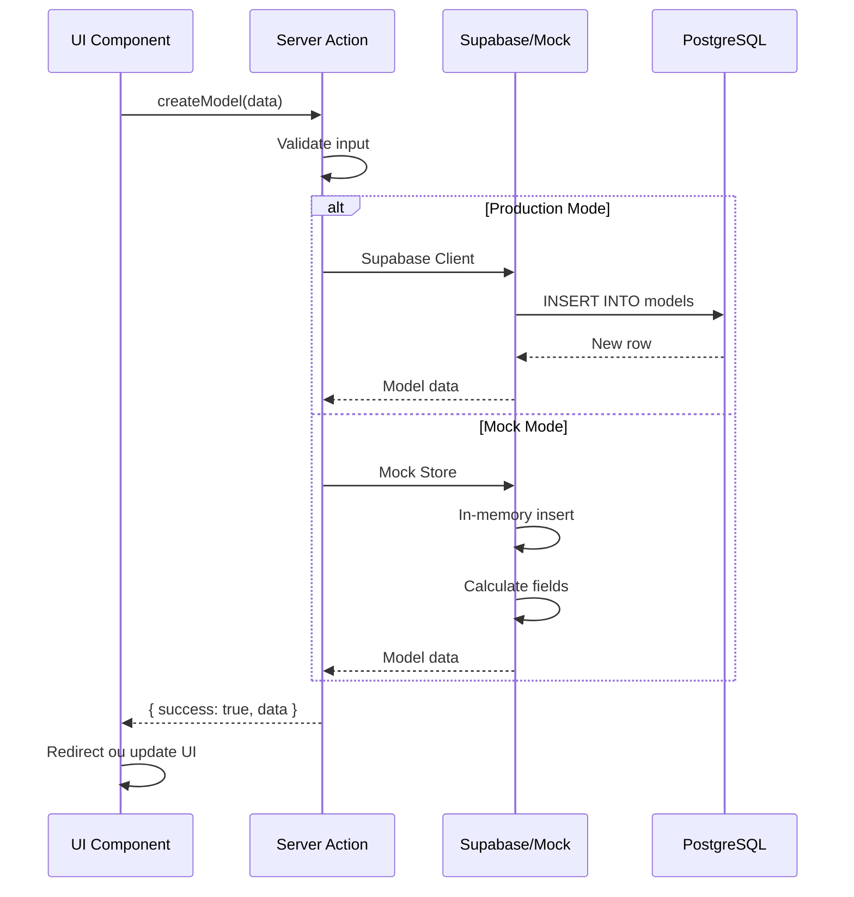

# How is data stored and accessed?

## Visão Geral

O sistema suporta **dois modos de armazenamento**:
- **Produção**: PostgreSQL via Supabase
- **Desenvolvimento**: In-Memory Store (Mock)

## Schema do Banco de Dados (Supabase)

### Tabela: `models`

| Coluna | Tipo | Descrição | Constraints |
|--------|------|-----------|-------------|
| `id` | uuid | ID único do modelo | PK, default: gen_random_uuid() |
| `user_id` | uuid | ID do usuário proprietário | FK → auth.users, NOT NULL |
| `company_name` | text | Nome da empresa | NOT NULL |
| `valuation_date` | date | Data da avaliação | NOT NULL |
| `model_data` | jsonb | Dados do modelo (DRE, Balanço, etc.) | DEFAULT '{}' |
| `created_at` | timestamptz | Data de criação | DEFAULT now() |
| `updated_at` | timestamptz | Última atualização | DEFAULT now() |

**Índices:**
- `user_id` (btree) - para queries por usuário
- `created_at` (btree) - para ordenação

**RLS (Row Level Security):**
```sql
-- Usuários só podem acessar seus próprios modelos
CREATE POLICY "Users can view own models"
  ON models FOR SELECT
  USING (auth.uid() = user_id);

CREATE POLICY "Users can insert own models"
  ON models FOR INSERT
  WITH CHECK (auth.uid() = user_id);

CREATE POLICY "Users can update own models"
  ON models FOR UPDATE
  USING (auth.uid() = user_id);

CREATE POLICY "Users can delete own models"
  ON models FOR DELETE
  USING (auth.uid() = user_id);
```

### Estrutura do `model_data` (JSONB)

```typescript
interface ModelData {
  // Dados do Ano Base
  baseYear?: {
    dre?: DREBaseInputs
    balanceSheet?: BalanceSheetBaseInputs
  }

  // Premissas de Projeção
  projections?: {
    dre?: DREProjectionInputs
    balanceSheet?: BalanceSheetProjectionInputs
    periods?: number // número de anos de projeção
  }

  // Premissas de Valuation
  assumptions?: {
    wacc?: number
    perpetualGrowthRate?: number
    terminalValueMethod?: 'gordon' | 'exit_multiple'
    exitMultiple?: number
  }

  // Resultados calculados
  results?: {
    fcff?: number[]
    enterpriseValue?: number
    equityValue?: number
    sharePrice?: number
  }
}
```

## Operações CRUD

### Criar Modelo

```typescript
import { createModel } from '@/lib/actions/models'

const result = await createModel({
  company_name: "Acme SaaS",
  valuation_date: "2024-12-31",
  model_data: {}
})

if (result.success) {
  console.log('Modelo criado:', result.data.id)
}
```

### Listar Modelos

```typescript
import { getUserModels } from '@/lib/actions/models'

const result = await getUserModels()

if (result.success) {
  result.data.forEach(model => {
    console.log(model.company_name, model.valuation_date)
  })
}
```

### Buscar Modelo por ID

```typescript
import { getModelById } from '@/lib/actions/models'

const result = await getModelById(modelId)

if (result.success) {
  const model = result.data
  console.log('Dados:', model.model_data)
}
```

### Atualizar Modelo

```typescript
import { updateModel } from '@/lib/actions/models'

const result = await updateModel(modelId, {
  company_name: "Novo Nome",
  model_data: {
    baseYear: {
      dre: {
        receita: 1000000,
        custoMercadoriaVendida: 300000,
        // ...
      }
    }
  }
})
```

### Deletar Modelo

```typescript
import { deleteModel } from '@/lib/actions/models'

const result = await deleteModel(modelId)

if (result.success) {
  console.log('Modelo deletado')
}
```

### Duplicar Modelo

```typescript
import { duplicateModel } from '@/lib/actions/models'

const result = await duplicateModel(modelId)

if (result.success) {
  console.log('Nova cópia criada:', result.data.id)
}
```

## Sistema Mock (In-Memory)

### Ativação

```env
# .env.local
NEXT_PUBLIC_USE_MOCK_DATA=true
```

### Implementação

**Mock Store (`src/lib/mock/store.ts`)**

```typescript
class MockStore {
  private models: Map<string, Model> = new Map()
  private sessions: Map<string, MockSession> = new Map()

  // CRUD operations
  async createModel(data: CreateModelInput): Promise<Model>
  async getModels(userId: string): Promise<Model[]>
  async getModelById(id: string): Promise<Model | null>
  async updateModel(id: string, data: UpdateModelInput): Promise<Model>
  async deleteModel(id: string): Promise<void>
}
```

**Características:**
- ✅ Simulação de latência de rede (100-300ms)
- ✅ Validações iguais ao Supabase
- ✅ Geração automática de IDs (UUID)
- ✅ Timestamps automáticos
- ✅ Auto-cálculo de campos dependentes
- ⚠️ Dados não persistem entre refreshes

### Dados de Exemplo

O mock inclui **5 modelos pré-configurados** com dados completos:

```typescript
// src/lib/mock/data/models.ts
export const MOCK_MODELS: Model[] = [
  {
    id: 'model-1',
    user_id: 'user-1',
    company_name: 'CloudCRM SaaS',
    valuation_date: '2024-12-31',
    model_data: {
      baseYear: {
        dre: {
          receita: 5000000,
          custoMercadoriaVendida: 1500000,
          despesasOperacionais: 2000000,
          // ... calculado automaticamente:
          // lucro_bruto, ebitda, lucro_liquido
        }
      }
    }
  },
  // ... mais 4 modelos
]
```

### Auto-cálculo de Campos

O sistema mock calcula automaticamente:

**DRE:**
- `lucro_bruto` = `receita` - `custoMercadoriaVendida`
- `ebitda` = `lucro_bruto` - `despesasOperacionais`
- `ebit` = `ebitda` - `depreciacao`
- `lucro_liquido` = `ebit` - `despesasFinanceiras` - `impostos`

**Balanço Patrimonial:**
- `ativo_circulante` = soma de `caixa`, `contasReceber`, `estoques`, etc.
- `ativo_total` = `ativo_circulante` + `ativo_nao_circulante`
- `passivo_total` = `passivo_circulante` + `passivo_nao_circulante`
- Validação: `ativo_total` = `passivo_total` + `patrimonio_liquido`

Implementação em `src/lib/mock/utils.ts`:

```typescript
export function calculateDerivedFields(dre: DREBaseInputs) {
  const lucro_bruto = (dre.receita || 0) - (dre.custoMercadoriaVendida || 0)
  const ebitda = lucro_bruto - (dre.despesasOperacionais || 0)
  // ...
  return { ...dre, lucro_bruto, ebitda, /* ... */ }
}
```

## Tipos TypeScript

```typescript
// src/types/valuation.ts
export interface Model {
  id: string
  user_id: string
  company_name: string
  valuation_date: string
  model_data: ModelData
  created_at: string
  updated_at: string
}

// src/core/types/index.ts
export interface DREBaseInputs {
  receita: number
  custoMercadoriaVendida: number
  despesasOperacionais: number
  despesasFinanceiras: number
  taxaImposto: number

  // Campos calculados
  lucro_bruto?: number
  ebitda?: number
  ebit?: number
  lucro_liquido?: number
}

export interface BalanceSheetBaseInputs {
  // Ativo Circulante
  caixa: number
  contasReceber: number
  estoques: number
  outrosAtivosCirculantes: number

  // Ativo Não Circulante
  ativoImobilizado: number
  outrosAtivosNaoCirculantes: number

  // Passivo Circulante
  fornecedores: number
  emprestimosCP: number
  outrosPassivosCirculantes: number

  // Passivo Não Circulante
  emprestimosLP: number
  outrosPassivosNaoCirculantes: number

  // Patrimônio Líquido
  capitalSocial: number
  reservas: number
  lucrosAcumulados: number
}
```

## Fluxo de Dados



## Migrations (Supabase)

Localização: `supabase/migrations/`

**Criar migration:**
```bash
supabase migration new create_models_table
```

**Aplicar migrations:**
```bash
supabase db push
```

**Exemplo de migration:**
```sql
-- supabase/migrations/20240101000000_create_models_table.sql
CREATE TABLE IF NOT EXISTS public.models (
    id UUID PRIMARY KEY DEFAULT gen_random_uuid(),
    user_id UUID REFERENCES auth.users(id) ON DELETE CASCADE NOT NULL,
    company_name TEXT NOT NULL,
    valuation_date DATE NOT NULL,
    model_data JSONB DEFAULT '{}'::jsonb,
    created_at TIMESTAMPTZ DEFAULT NOW(),
    updated_at TIMESTAMPTZ DEFAULT NOW()
);

-- Índices
CREATE INDEX idx_models_user_id ON public.models(user_id);
CREATE INDEX idx_models_created_at ON public.models(created_at DESC);

-- RLS
ALTER TABLE public.models ENABLE ROW LEVEL SECURITY;

-- Policies (ver acima)
```

## Performance

### Otimizações Implementadas

✅ **Índices**: `user_id`, `created_at`
✅ **Paginação**: Suporte para limit/offset
✅ **JSONB**: Armazenamento eficiente de dados nested
✅ **RLS**: Segurança em nível de linha

### Queries Otimizadas

```typescript
// Lista modelos do usuário (usa índice)
const { data } = await supabase
  .from('models')
  .select('*')
  .eq('user_id', userId)
  .order('created_at', { ascending: false })
  .limit(20)

// Busca específica (usa PK)
const { data } = await supabase
  .from('models')
  .select('*')
  .eq('id', modelId)
  .single()
```

## Troubleshooting

### "Row Level Security" error

- RLS está ativo mas política não permite operação
- Verifique se usuário está autenticado
- Confirme que `user_id` corresponde ao usuário atual

### JSONB query lenta

- Considere extrair campos frequentemente consultados
- Use índices GIN para busca em JSONB

### Mock data não persiste

- **Esperado**: Mock usa memória, não persiste
- Para persistência, use Supabase (produção mode)