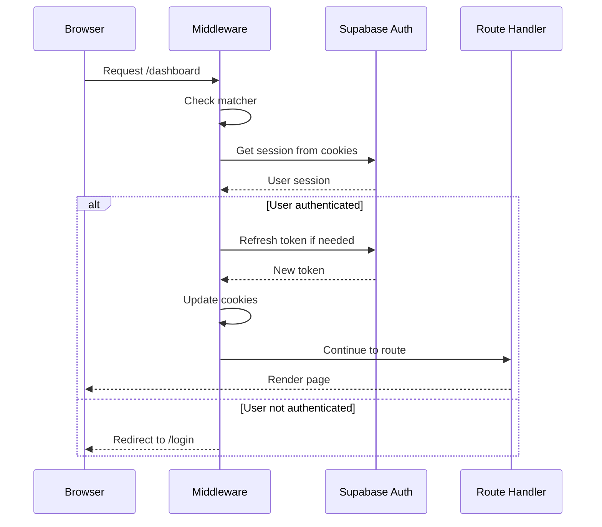

# How does middleware work?

## Visão Geral

O middleware do Next.js executa **antes** de cada requisição, permitindo:
- ✅ Autenticação e autorização
- ✅ Renovação de tokens JWT
- ✅ Redirecionamentos condicionais
- ✅ Validação de sessões

## Arquivo Principal

```typescript
// middleware.ts (raiz do projeto)
import { type NextRequest } from 'next/server'
import { updateSession } from '@/lib/supabase/middleware'

export async function middleware(request: NextRequest) {
  return await updateSession(request)
}

export const config = {
  matcher: [
    '/((?!_next/static|_next/image|favicon.ico|.*\\.(?:svg|png|jpg|jpeg|gif|webp)$).*)',
  ],
}
```

## Fluxo de Execução



## Implementação do `updateSession`

```typescript
// src/lib/supabase/middleware.ts
export async function updateSession(request: NextRequest) {
  let supabaseResponse = NextResponse.next({
    request,
  })

  const supabase = createServerClient(
    process.env.NEXT_PUBLIC_SUPABASE_URL!,
    process.env.NEXT_PUBLIC_SUPABASE_ANON_KEY!,
    {
      cookies: {
        getAll() {
          return request.cookies.getAll()
        },
        setAll(cookiesToSet) {
          cookiesToSet.forEach(({ name, value, options }) =>
            supabaseResponse.cookies.set(name, value, options)
          )
        },
      },
    }
  )

  // Renovar sessão
  const {
    data: { user },
  } = await supabase.auth.getUser()

  // Proteção de rotas
  const isAuthRoute = request.nextUrl.pathname.startsWith('/login') ||
                      request.nextUrl.pathname.startsWith('/signup')
  const isProtectedRoute = request.nextUrl.pathname.startsWith('/dashboard') ||
                           request.nextUrl.pathname.startsWith('/model')

  // Redirecionar não autenticados de rotas protegidas
  if (!user && isProtectedRoute) {
    const url = request.nextUrl.clone()
    url.pathname = '/login'
    return NextResponse.redirect(url)
  }

  // Redirecionar autenticados de rotas de auth
  if (user && isAuthRoute) {
    const url = request.nextUrl.clone()
    url.pathname = '/dashboard'
    return NextResponse.redirect(url)
  }

  return supabaseResponse
}
```

## Matcher Configuration

O `matcher` define quais rotas o middleware processa:

```typescript
export const config = {
  matcher: [
    // Match todas as rotas EXCETO:
    '/((?!_next/static|_next/image|favicon.ico|.*\\.(?:svg|png|jpg|jpeg|gif|webp)$).*)',
  ],
}
```

**Exclui:**
- `_next/static/*` - Assets estáticos do Next.js
- `_next/image/*` - Image optimization API
- `favicon.ico` - Favicon
- `*.svg`, `*.png`, `*.jpg`, etc. - Imagens

**Inclui:**
- Todas as outras rotas (`/`, `/login`, `/dashboard`, etc.)

## Suporte ao Modo Mock

Quando `NEXT_PUBLIC_USE_MOCK_DATA=true`, o middleware adapta-se:

```typescript
// src/lib/supabase/middleware.ts (com mock support)
import { isMockMode } from '@/lib/mock/config'
import { getMockSession } from '@/lib/mock/auth'

export async function updateSession(request: NextRequest) {
  if (isMockMode()) {
    // Modo Mock: valida sessão em memória
    const session = getMockSession()

    const isProtectedRoute = /* ... */
    const isAuthRoute = /* ... */

    if (!session && isProtectedRoute) {
      return NextResponse.redirect(new URL('/login', request.url))
    }

    if (session && isAuthRoute) {
      return NextResponse.redirect(new URL('/dashboard', request.url))
    }

    return NextResponse.next()
  }

  // Modo Production: usar Supabase
  // ... (código original)
}
```

## Funcionalidades Implementadas

### 1. **Proteção de Rotas**

```typescript
// Rotas protegidas (requerem autenticação)
const protectedPatterns = [
  '/dashboard',
  '/model/*',
]

// Rotas de autenticação (redirecionam se já autenticado)
const authPatterns = [
  '/login',
  '/signup',
  '/forgot-password',
  '/reset-password',
]
```

### 2. **Renovação Automática de Tokens**

- Middleware chama `supabase.auth.getUser()`
- Supabase SDK renova token se expirado
- Cookies são atualizados automaticamente

### 3. **Redirecionamentos Inteligentes**

| Condição | Ação |
|----------|------|
| Não autenticado → rota protegida | Redireciona para `/login` |
| Autenticado → rota de auth | Redireciona para `/dashboard` |
| Autenticado → rota protegida | Permite acesso |
| Qualquer → rota pública | Permite acesso |

### 4. **Cookies HTTP-Only**

```typescript
cookies: {
  getAll() {
    return request.cookies.getAll()
  },
  setAll(cookiesToSet) {
    cookiesToSet.forEach(({ name, value, options }) => {
      supabaseResponse.cookies.set(name, value, {
        ...options,
        httpOnly: true, // Proteção XSS
        secure: process.env.NODE_ENV === 'production', // HTTPS em prod
        sameSite: 'lax', // CSRF protection
      })
    })
  },
}
```

## Debugging

### Logs de Middleware

```typescript
export async function middleware(request: NextRequest) {
  console.log('[Middleware]', {
    path: request.nextUrl.pathname,
    method: request.method,
    timestamp: new Date().toISOString(),
  })

  const response = await updateSession(request)

  console.log('[Middleware] Response:', {
    status: response.status,
    redirected: response.redirected,
  })

  return response
}
```

### Verificar Headers

```typescript
// No middleware
console.log('Headers:', Object.fromEntries(request.headers))
console.log('Cookies:', request.cookies.getAll())
```

## Performance

### Otimizações Implementadas

✅ **Edge Runtime**: Middleware roda em Edge (baixa latência)
✅ **Caching**: Supabase SDK faz cache de validação de sessão
✅ **Matcher preciso**: Evita executar em assets estáticos

### Métricas Típicas

- **Latência**: 50-150ms (Edge)
- **Renovação de token**: ~200ms (quando necessário)
- **Redirecionamento**: <50ms

## Limitações

⚠️ **Não pode:**
- Renderizar React components
- Usar hooks (`useState`, `useEffect`)
- Acessar `window` ou `document`

✅ **Pode:**
- Ler/escrever cookies
- Fazer redirects
- Modificar headers
- Fazer fetch (APIs externas)

## Ordem de Execução

```
1. Request do browser
2. ✅ Middleware executa
3. ✅ Layout.tsx (se Server Component)
4. ✅ Page.tsx
5. Response ao browser
```

## Rotas Públicas (Bypass)

Para adicionar rotas públicas que não precisam de auth:

```typescript
// src/lib/supabase/middleware.ts
const publicRoutes = ['/', '/about', '/pricing']

export async function updateSession(request: NextRequest) {
  const pathname = request.nextUrl.pathname

  // Bypass para rotas públicas
  if (publicRoutes.includes(pathname)) {
    return NextResponse.next()
  }

  // ... resto da lógica
}
```

## Headers Customizados

```typescript
export async function middleware(request: NextRequest) {
  const response = await updateSession(request)

  // Adicionar headers de segurança
  response.headers.set('X-Frame-Options', 'DENY')
  response.headers.set('X-Content-Type-Options', 'nosniff')
  response.headers.set('Referrer-Policy', 'origin-when-cross-origin')

  return response
}
```

## Troubleshooting

### Redirect loop infinito

**Causa:** Lógica de redirect circular

**Solução:**
```typescript
// Evitar redirecionar na própria rota de destino
if (!user && isProtectedRoute && pathname !== '/login') {
  return NextResponse.redirect(new URL('/login', request.url))
}
```

### Cookies não persistem

**Causa:** `setAll()` não está sendo chamado corretamente

**Solução:**
```typescript
cookies: {
  setAll(cookiesToSet) {
    // Aplicar em AMBAS as respostas
    cookiesToSet.forEach(({ name, value, options }) => {
      request.cookies.set(name, value) // Para próxima requisição
      supabaseResponse.cookies.set(name, value, options) // Para response
    })
  },
}
```

### Middleware não executa

**Causa:** Path não corresponde ao matcher

**Solução:** Verifique o matcher:
```typescript
export const config = {
  matcher: [
    '/dashboard/:path*', // Inclui todas sub-rotas
    '/model/:path*',
  ],
}
```

## Best Practices

✅ **Sempre retorne uma Response**: `NextResponse.next()` ou `NextResponse.redirect()`
✅ **Use Edge-compatible APIs**: Evite Node.js APIs (fs, crypto.randomBytes, etc.)
✅ **Mantenha lógica simples**: Middleware deve ser rápido
✅ **Teste redirects**: Verifique comportamento em dev e prod
✅ **Log em desenvolvimento**: Facilita debugging
