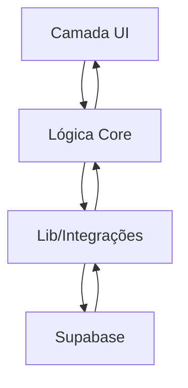

## Notas de Arquitetura

O sistema SaaS Valuation é projetado como uma aplicação web modular usando Next.js, com separação clara entre componentes de UI, lógica de domínio e integrações de infraestrutura. A arquitetura enfatiza manutenibilidade, testabilidade e escalabilidade, utilizando TypeScript para segurança de tipos e Supabase para serviços de backend.

## Visão Geral da Arquitetura do Sistema

A aplicação segue uma abordagem de monólito modular, onde todos os módulos principais residem em um único repositório, mas são organizados por domínio e responsabilidade. As requisições dos usuários fluem do frontend (React/Next.js) pela lógica de domínio em `src/core/` e interagem com o Supabase para autenticação, persistência de dados e armazenamento de arquivos. Toda a lógica de negócio é isolada das preocupações de infraestrutura.

## Camadas Arquiteturais

- **Camada App**: Interface do usuário e roteamento (`src/app/`, `src/components/`)
- **Camada Core**: Lógica de domínio, cálculos e regras de negócio (`src/core/`)
- **Camada Lib**: Utilitários, integrações e helpers compartilhados (`src/lib/`)
- **Camada Types**: Definições de tipos compartilhados (`src/types/`, `src/core/types/`)
- **Camada Styles**: Sistema de design e estilos globais (`src/styles/`)

> Veja [`codebase-map.json`](./codebase-map.json) para contagem completa de símbolos e gráficos de dependência.

## Padrões de Design Detectados

| Padrão        | Confiança | Localizações                               | Descrição                                   |
| ------------- | --------- | ------------------------------------------ | ------------------------------------------- |
| Modularização | Alta      | `src/core/`, `src/lib/`, `src/components/` | Separação de responsabilidades por domínio  |
| Adapter       | Média     | `src/lib/supabase/`, `src/lib/actions/`    | Abstrai integração com serviços externos    |
| Factory       | Média     | `src/lib/supabase/client.ts`, `server.ts`  | Cria clientes Supabase configurados         |
| Validação     | Alta      | `src/core/validators/`                     | Lógica centralizada de validação de entrada |

## Pontos de Entrada

- [middleware.ts](../../middleware.ts)
- [src/app/layout.tsx](../../src/app/layout.tsx)
- [src/app/(auth)/login/page.tsx](<../../src/app/(auth)/login/page.tsx>)
- [src/app/(dashboard)/model/[id]/](<../../src/app/(dashboard)/model/[id]/>)

## API Pública

| Símbolo            | Tipo       | Localização                                                                        |
| ------------------ | ---------- | ---------------------------------------------------------------------------------- |
| ApiError           | tipo       | [src/types/index.ts](../../src/types/index.ts#L21)                                 |
| APIRequest         | tipo       | [src/core/types/index.ts](../../src/core/types/index.ts#L71)                       |
| ApiResponse        | tipo       | [src/types/index.ts](../../src/types/index.ts#L14)                                 |
| APIResponse        | tipo       | [src/core/types/index.ts](../../src/core/types/index.ts#L76)                       |
| AppSidebar         | componente | [src/components/app-sidebar.tsx](../../src/components/app-sidebar.tsx#L159)        |
| Assumptions        | tipo       | [src/core/types/index.ts](../../src/core/types/index.ts#L49)                       |
| AuthSession        | tipo       | [src/types/user.ts](../../src/types/user.ts#L39)                                   |
| BalanceSheet       | tipo       | [src/types/financial.ts](../../src/types/financial.ts#L23)                         |
| BalanceSheet       | tipo       | [src/core/types/index.ts](../../src/core/types/index.ts#L27)                       |
| calculateValuation | função     | [src/core/calculations/valuation.ts](../../src/core/calculations/valuation.ts#L21) |
| calculateWACC      | função     | [src/core/calculations/wacc.ts](../../src/core/calculations/wacc.ts#L27)           |
| createClient       | função     | [src/lib/supabase/server.ts](../../src/lib/supabase/server.ts#L5)                  |
| createModel        | função     | [src/lib/actions/models.ts](../../src/lib/actions/models.ts#L122)                  |
| duplicateModel     | função     | [src/lib/actions/models.ts](../../src/lib/actions/models.ts#L275)                  |

## Limites Internos do Sistema

A lógica de domínio em `src/core/` é desacoplada da infraestrutura e da UI. Integrações com o Supabase são abstraídas em `src/lib/supabase/`. Tipos compartilhados reforçam contratos entre camadas.

## Dependências de Serviços Externos

- **Supabase**: Auth, banco de dados e armazenamento de arquivos. Usa JWT para autenticação e SDK para chamadas de API.

## Decisões e Trade-offs Importantes

- Escolha do monólito modular para simplicidade e manutenibilidade.
- TypeScript para segurança de tipos e tooling para desenvolvedores.
- Supabase para provisionamento rápido de backend e auth gerenciado.

## Diagramas

## Riscos & Restrições

- Escalabilidade limitada pelo plano do Supabase e modelo serverless do Next.js.
- Todas as operações são síncronas; não há processamento orientado a eventos ou filas.

## Snapshot dos Principais Diretórios

- `src/app/` — UI, roteamento e páginas
- `src/components/` — Componentes de UI e layout
- `src/core/` — Lógica de domínio e cálculos
- `src/lib/` — Utilitários e integrações
- `src/types/` — Definições de tipos compartilhados
- `src/styles/` — Sistema de design e estilos globais

## Recursos Relacionados

- [Visão Geral do Projeto](./project-overview.md)
- [Fluxo de Dados](./data-flow.md)
- [codebase-map.json](./codebase-map.json)
