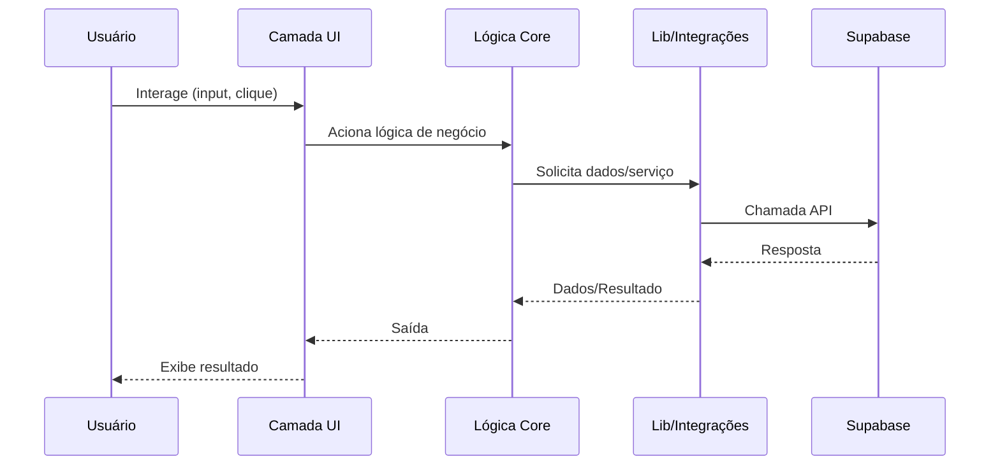

## Fluxo de Dados & Integrações

Os dados no aplicativo SaaS Valuation fluem das interações do usuário no frontend, passando pela lógica de domínio, até o armazenamento persistente ou APIs externas. O sistema é projetado para manter a lógica de negócio isolada da infraestrutura, com limites claros entre módulos. O Supabase é a principal integração externa, cuidando de autenticação, banco de dados e armazenamento de arquivos.

## Dependências de Módulos

- **src/app/** → `core`, `components`, `lib`, `styles`
- **src/core/** → `lib`, `types`, `utils`
- **src/lib/** → `supabase`, `utils`
- **src/components/** → `ui`, `core`
- **src/styles/** → `design-system`

## Camada de Serviços

- [src/core/company/](../../src/core/company/) — Serviços do domínio de empresas
- [src/core/financial/](../../src/core/financial/) — Serviços de dados financeiros
- [src/core/valuation/](../../src/core/valuation/) — Serviços de lógica de valuation
- [src/lib/supabase/server.ts](../../src/lib/supabase/server.ts) — Integração com Supabase

## Fluxo em Alto Nível

Ações do usuário na interface disparam eventos tratados por componentes e roteados para a lógica de domínio em `src/core/`. Esses módulos processam dados, aplicam regras de negócio e interagem com o Supabase via a camada de integração em `src/lib/supabase/`. Os resultados retornam para a interface para exibição ou novas ações.

## Movimento Interno

Os módulos se comunicam via chamadas de função e tipos compartilhados. Não há filas de mensagens ou barramentos de eventos neste estágio; todas as operações são síncronas e em processo.

## Integrações Externas

- **Supabase**: Usado para autenticação (JWT), banco de dados (Postgres) e armazenamento de arquivos. Gerencia tentativas e erros via SDK. Payloads são codificados em JSON.

## Observabilidade & Modos de Falha

Logs e tratamento de erros são implementados na camada de integração. O SDK do Supabase fornece objetos de erro e códigos de status, que são exibidos na interface para feedback ao usuário. Não há tracing distribuído ou observabilidade avançada implementada atualmente.

---

Veja também: [Notas de Arquitetura](./architecture.md)
